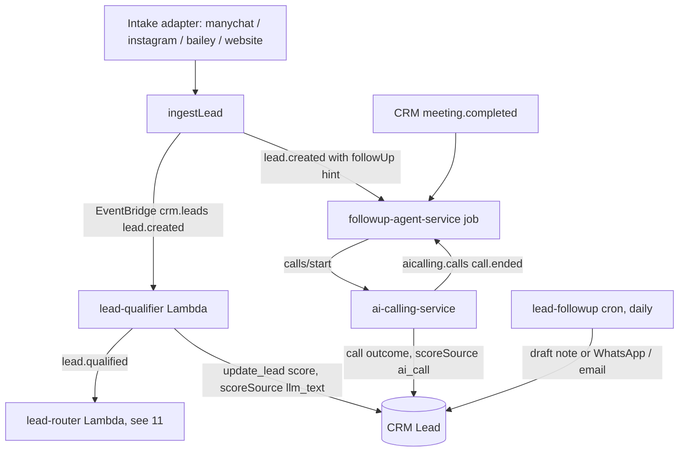

# 09 — Lead Qualification Engine (+ Sales Assistant & Follow-Up)

> **Status (17 Sep 2026):** As built + roadmap. Checked against the code on main. The June per-turn qualifier, customer-facing chat assistant and Step Functions journeys were not built; this doc now describes the lead-level Gemini qualifier, the voice agent and the two follow-up paths that were built instead.

> **Note:** The founder is building a next-generation lead engine separately; these docs will be updated when it lands.

> **Scope:** how a new lead gets a first qualification, where customer-facing AI answers questions today, and how follow-up runs. Related: `04` (agents), `08` (channels), `10` (scoring), `11` (assignment), `12` (voice), `14` (knowledge).

---

## 1. What the Lead record holds

Requirement data lives on the Lead as sub-objects: `buyerRequirement`, `tenantRequirement`, `sellerProperty` and `ownerProperty` (`apps/crm/real-estate-crm-app/src/types/crm.ts`). The buyer object carries `requirement`, `budget`, `preferredArea`, `city`, `bhk`, `propertyType`, `propertySubType` and `timeline`. There are no `purpose` (end use vs investment) or `financing` fields.

Every intake adapter (`manychat`, `instagram`, `insta-agent`, `bailey`, `website`) creates leads through the same server-side ingestion path, which publishes an EventBridge `lead.created` event (`apps/crm/server/leadIngestion.js`, `apps/crm/server/routes/leads.js`).

## 2. How a lead gets qualified today

There are three places where slots are extracted or a lead is qualified. They are separate code paths.

| Path | Trigger | What it does | Code |
|---|---|---|---|
| **CRM lead qualifier** | EventBridge `lead.created` | One Gemini call per lead scores it HOT / WARM / COLD against a written rubric, writes `score`, `scoreValue`, `scoreReasons`, `scoredAt`, `scoreSource: 'llm_text'`, then publishes `lead.qualified` | `apps/crm/server/scripts/lead-qualifier-handler.js`, `apps/crm/server/utils/leadRubric.js` |
| **Instagram DM analyst** | New or updated DM thread in the Instagram service | Pulls phone, budget, area, intent and property type with rules (or Gemini when a key is set), scores the lead, and drafts a Hinglish reply for a human to send | `apps/instagram/backend_insta_sol_ms/services/leadAnalyst.js`, `services/extract.js` |
| **AI qualification call** | A user presses "qualify call" (`POST /api/crm/leads/:id/qualify-call`) | The voice agent classifies the lead on the same rubric during a call capped at 180 s and submits the verdict silently; the CRM overwrites the text score with `scoreSource: 'ai_call'` | `apps/crm/server/routes/leads.js`, `apps/crm/server/routes/aiCallingInternal.js`, `services/ai-calling-service/README.md` |

How the CRM qualifier behaves:

- It runs once per lead. It skips a lead scored in the last 24 hours (`QUALIFY_COOLDOWN_MS`).
- It runs only for tenants whose AI Employee provisioning is `live` and whose `aiEmployeeEnabled` flag is on.
- The model is constrained by a response schema (`QUALIFIER_RESPONSE_SCHEMA`), so output is JSON, not prose. If nothing usable comes back it stores a neutral WARM / 50 and logs `leadQualifier.unparseable_output`.
- The model call goes through `invokeAgent(tenantId, 'qualifier', ...)` in `apps/crm/server/agents/agentRuntime.js`, which reads `GEMINI_API_KEY` and `GEMINI_MODEL` (CFN default `gemini-3.8-flash`).

It does not extract slots turn by turn and does not suggest a next question. The scoring rubric itself is described in `10`.

**Known gap (check before relying on it):** in `apps/crm/server/infra/cfn-backend.yaml` the `${Env}-realestateflow-lead-qualifier` and `-lead-router` Lambdas do not receive `GEMINI_API_KEY` / `GEMINI_MODEL`, and unlike the API Lambda they do not hydrate config from SSM. As written, the single-shot agent would return `llm_not_configured`, no score would be written and `lead.qualified` would not fire. Confirm in the dev CloudWatch logs.

## 3. Customer-facing AI answers today

| Channel | Who it talks to | What exists |
|---|---|---|
| **AI voice call** | The lead | The only customer-facing conversational AI. ElevenLabs agent with nine server tools: `search_properties`, `get_property_details`, `schedule_site_visit`, `answer_policy_question`, `submit_qualification`, `request_human_handoff`, `confirm_site_visit`, `record_visit_feedback`, `request_callback` (`services/ai-calling-service/elevenlabs-agent-tools.md`). Built, not live yet (see `12`). |
| **WhatsApp (Baileys)** | Agency staff | Staff command channel into the CRM agent, not a customer assistant (`apps/crm/server/bailey.js`, `docs/proposals/agent-channel-architecture/flows/01-whatsapp-agent.md`). |
| **Web CRM chat** | Agency staff | Same agent runtime, operator-facing (`apps/crm/server/agents/channels/webChannel.js`). |
| **Instagram** | Human sends | Drafted Hinglish replies only (`leadAnalyst.js`). |

Where the grounded facts come from:

- Property data: the CRM internal API (`apps/crm/server/routes/aiCallingInternal.js`) and semantic matching through `match_properties` on DynamoDB vector search (`apps/crm/server/services/embeddings/`).
- Policy answers: passages from the agency's own policy text (`apps/crm/server/services/knowledge/policySearchService.js`, see `14`).
- Site visits and callbacks: `POST /api/internal/site-visits`, the voice tools above, public site-visit booking on property pages (`apps/crm/server/siteVisitBooking.js`, `apps/property-pages-ms`), and "Schedule AI follow-up" jobs (`apps/crm/server/services/followupService.js`).
- Brochure and floor-plan tools do not exist (none in `apps/crm/server/shared/toolDefinitions.js`).

Prompt caching: the chat pipeline keeps a stable prompt prefix so Gemini's implicit caching applies; the ordering is locked by `apps/crm/server/agents/llm/plannerPrompt.caching.test.js`. Explicit context caching is not used.

## 4. Follow-up as built

Follow-up is built in two independent pieces. Neither uses Step Functions.

**a) Follow-up call jobs: `services/followup-agent-service`.** A DynamoDB job table plus an EventBridge tick every 5 minutes. Two job types:

| Job | Trigger | Goal |
|---|---|---|
| `site_visit_confirmation` | `lead.created` with a `followUp` hint (for example an Instagram DM that asked for a call), the CRM "Schedule AI follow-up" button, or, if the tenant opts in, any new Instagram lead with a phone | Confirm or reschedule the visit |
| `post_visit_feedback` | `meeting.completed` for a site visit, 2 hours later by default | Ask how the visit went |

Each job gets up to 2 call attempts, 45 minutes apart, inside the tenant's business hours. After that, or when the customer asks for a human, it escalates to the lead's assignee and the agency admins (`services/followup-agent-service/README.md`).

**b) Stale-lead nudge: `apps/crm/server/scripts/lead-followup-cron.js`.** Runs daily at 04:00 IST (`${Env}-realestateflow-lead-followup`). It finds leads in `new`, `contacted`, `qualified` or `negotiating` with no activity for 1 to 7 days, and either writes a draft note for review (`followupAgentMode: 'draft'`, the default) or sends a message over WhatsApp or email (`autosend`).

Other reminders that exist:

- Meeting reminders 15 minutes before a CRM meeting, drained every 5 minutes by `apps/crm/server/scripts/meeting-reminder-cron.js`.

Trigger coverage against the June list:

| June trigger | Status |
|---|---|
| Site visit booked → reminders / confirmation | Built (meeting reminder + `site_visit_confirmation` call) |
| Post-visit → feedback | Built (`post_visit_feedback` call) |
| Going cold → re-engagement | Built as the daily stale-lead nudge (draft or autosend) |
| New qualified lead → send brochure | Not built |
| Viewed but no reply | Not built |
| Price interest → payment plan | Not built |
| Inventory match alert | Not built |

WhatsApp today is Baileys, which has no template categories or per-template pricing. Template and 24-hour-window rules will apply once customer messaging moves to the official WhatsApp Business Cloud API (`39`). Consent handling is not implemented in either follow-up path (see `12` for the voice consent decision).

## 5. Data and event flow (as built)

## 6. Built since June

- `apps/crm/server/routes/aiCallingInternal.js` is enabled and mounted at `/api/internal`. It serves lead context, property lookups, semantic property matching, policy answers, site visits and call outcomes.
- The regex intent classifier in the calling service was deleted in Sep 2026 (commit `bdff45e`). The ElevenLabs agent's own model now decides when to call server tools. `INTENT_TYPES` remain only as labels (`services/ai-calling-service/src/config/constants.js`). On the chat side, `apps/crm/server/agents/domainRouter.js` routes with rules first and a Gemini classifier as fallback.
- Lead conversion logic lives in `apps/crm/server/services/leadConversionService.js`.

## 7. Roadmap (from the founder decisions)

These are kept as roadmap items. No new target design is written here (D11).

- WhatsApp nurture journeys, on the official Cloud API (`39`). Phase C.
- Instagram DM assistant: drafts first, auto-send later. Phase C.
- Brochure and floor-plan tools. Phase C.
- Voice stays outbound only at launch, with consent captured at intake (`12`).

> **Open question:** which engine runs multi-step WhatsApp nurture journeys: extend the `followup-agent-service` job engine with new job types, or something else? Not decided.

## 8. Considered in June, not adopted

- A per-turn Lead Qualifier (Haiku) that extracted slots and suggested the next best question, plus `purpose` and `financing` slots.
- An autonomous customer-facing Sales Assistant (Sonnet) on WhatsApp and web chat, backed by separate Property, Knowledge and Document MCP servers.
- Follow-up journeys as Step Functions state machines, with `LeadQualified` / `VisitBooked` / `JourneyStarted` events.

## 9. KPIs

Qualification rate, share of leads with a score, `ai_call` vs `llm_text` score agreement, qualified-lead → visit conversion, follow-up jobs escalated vs done, touches to conversion, cost per qualified lead.
