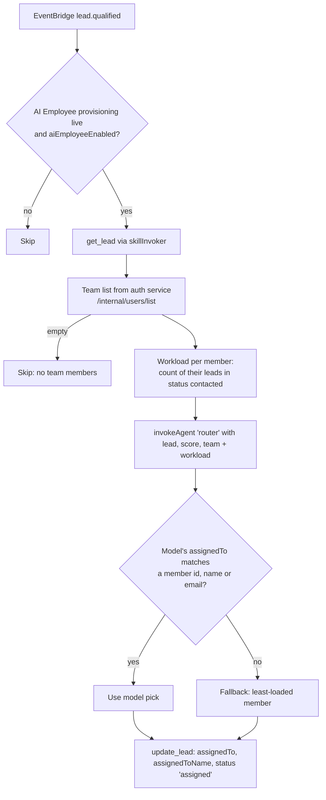

# 11 — Lead Assignment Engine

> **Status (17 Sep 2026):** As built + roadmap. Checked against the code on main. The June deterministic rule chain (territories, capacity, SLA timers) was not built; an event-driven router that asks Gemini to pick the assignee, with a least-loaded fallback, was built instead.

> **Note:** The founder is building a next-generation lead engine separately; these docs will be updated when it lands.

> **Scope:** how a qualified lead gets an owner today, manual assignment, and what visibility rules apply. Related: `10` (scoring), `09` (follow-up), `15` (roles).

---

## 1. The router as built

Code: `apps/crm/server/scripts/lead-router-handler.js`. Lambda `${Env}-realestateflow-lead-router`, triggered by the EventBridge rule on `lead.qualified` (source `crm.leads`, published by the qualifier in `09`). Defined in `apps/crm/server/infra/cfn-backend.yaml`.

Details:

- **Gate:** runs only when the tenant's AI Employee provisioning is `live` and `aiEmployeeEnabled` is on.
- **Team:** fetched from the auth service with `x-internal-api-key`, 5-second timeout. If the call fails or returns nobody, the lead is left unassigned.
- **Workload:** the number of leads assigned to that member with `status: 'contacted'`. There is no WIP cap.
- **Decision:** a single Gemini call (`invokeAgent(tenantId, 'router', ...)`, `GEMINI_MODEL`) returns `{"assignedTo", "reason"}`. The code only falls back to the least-loaded member when the model's pick doesn't match anyone or the call fails. The model's `reason` is not stored.
- **Write:** `update_lead` through `skillInvoker` with `assignedTo`, `assignedToName` and `status: 'assigned'`.

**Known gaps:**

- `'assigned'` is not a value of `LeadStatus` (`apps/crm/real-estate-crm-app/src/types/crm.ts`: `new | contacted | qualified | site_visit | negotiating | converted | lost | spam`), so leads the router touches carry a status the UI does not recognise.
- The router Lambda, like the qualifier, does not receive `GEMINI_API_KEY` / `GEMINI_MODEL` in the template (see `09 §2`). It also needs `INTERNAL_API_KEY` and `AUTH_SERVICE_DOMAIN_NAME` for the team fetch, and neither is set on that function. As written, the team list would come back empty and the lead would stay unassigned (the least-loaded fallback never runs without a team). Confirm in dev logs.
- A feature toggle `AI_ROUTING` exists in `apps/crm/server/featureToggleService.js`; the router handler does not check it.

## 2. Manual assignment

- Users change the assignee on a lead through `PUT /api/crm/leads/:id` (`apps/crm/server/routes/leads.js`). The new assignee gets a notification (`notifyLeadAssigned`).
- Lead `history` is kept on the record. The previous assignee is not notified.
- The lead list accepts `assignedTo` and `unassigned` filters.

## 3. Roles and visibility today

- The auth service issues only `ADMIN` and `MEMBER` (`services/reality-flow-authentication/src/controllers/phoneAuthCustomController.ts`).
- The CRM middleware also accepts `MANAGER`, `OWNER` and `FOUNDER` strings, but nothing issues them (`apps/crm/server/middleware/requireRole.js`).
- Members can see all leads in the tenant. Nothing scopes the lead list by the caller.

Per D15: ADMIN/MEMBER is the M1 model. A `MANAGER` role and "members see only their own leads" come before selling Team plans (Phase B). See `15 §4`.

## 4. Status against the June design

| June item | Status |
|---|---|
| Automatic assignment on qualification | Built (LLM pick + least-loaded fallback) |
| Round-robin | Not built |
| Region / territory, project, team, quality-based rules | Not built |
| Per-tenant assignment rules config | Not built |
| Availability and WIP capacity | Not built (workload count only) |
| SLA timer with escalation / reassignment on a lead | Not built. `apps/crm/server/scripts/escalation-cron.js` is about AI Employee *provisioning* SLA, not lead response. The nearest thing is `services/followup-agent-service` escalating unreached follow-up calls to the assignee and admins. |
| `AssignmentMade` event and task creation | Not built |
| Agent sees only own leads; manager sees team | Not built (D15: Phase B) |
| Reassignment keeps history and notifies | Partly (history kept, new assignee notified) |
| Returning lead goes to prior owner | Not built |

## 5. Considered in June, not adopted

A deterministic, per-tenant rule chain (project specialist → territory round-robin → senior pool for Hot → general round-robin → manager queue), with agent attributes (territory, specialties, languages, seniority), availability and WIP caps, an SLA timer that escalates or reassigns, an optional Haiku tiebreak, and an "AI nurture pool" as an assignee. Per D11 no new target design is written here.

## 6. KPIs

Time from `lead.qualified` to assignment, share of assignments that used the fallback, workload balance across members, reassignment rate, assigned-lead conversion.
