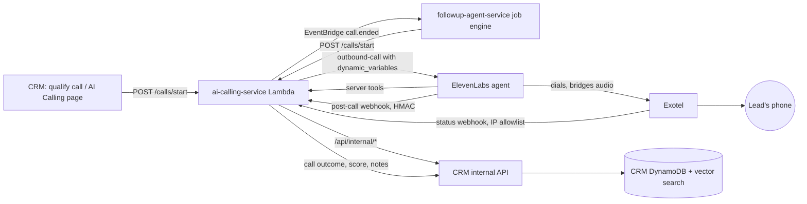

# 12 — AI Voice Architecture

> **Status (17 Sep 2026):** As built + roadmap. Checked against the code on main. The calling service was rebuilt in Sep 2026 on ElevenLabs' native Exotel integration (the June "Stack A"); the regex intent brain and Bedrock KB are gone. Outbound calls and follow-up call jobs are built but not live; inbound is later.

> **Scope:** AI voice calls to leads in English / Hindi / Hinglish on licensed Indian telephony: what is built, what is left before go-live, and the compliance stance. Vendor rates quoted in June should be reconfirmed before budgeting (`20`).

---

## 1. What exists (Sep 2026)

Code: `agency-app/ai-calling/` (Lambda + API Gateway + one DynamoDB table + knowledge and recordings S3 buckets + one Secrets Manager secret, template `agency-app/ai-calling/infra/cfn-ai-calling.yaml`, wrapper `infra/cicd/agency-app/ai-calling/deploy.sh`).

The original June-era service was audited on 2026-09-02 and found never to have worked: it created an ElevenLabs conversation and dialled through Exotel as two unconnected operations, with no audio bridge, and had never been deployed (`docs/agency-app/ai-calling/GO-LIVE-RUNBOOK.md`). It was rebuilt (commit `bdff45e`):

- **One request places the call and bridges the audio:** `POST /v1/convai/exotel/outbound-call` to ElevenLabs, which dials through Exotel.
- **One shared ElevenLabs agent per environment** serves every tenant. Per-call values (`agency_name`, `lead_name`, `lead_context`, `rubric`, ...) travel as `dynamic_variables`. Per-tenant `agentId` / `agentPhoneNumberId` are optional overrides only. There is one Exotel account per environment.
- **Server tools replace the regex intents.** The agent's own model decides when to call them. Nine tools hit `/api/ai-calling/tools/*` on the calling service, which calls the CRM internal API (`/api/internal/*`, `agency-app/api/routes/aiCallingInternal.js`), not MCP:
  `search_properties`, `get_property_details`, `schedule_site_visit`, `answer_policy_question`, `submit_qualification`, `request_human_handoff`, `confirm_site_visit`, `record_visit_feedback`, `request_callback` (`agency-app/ai-calling/elevenlabs-agent-tools.md`).
- **Tenant isolation:** DynamoDB keys `TENANT#{tenantId}#CALL#...`; server tools take the tenant from a `secret__tenant_id` dynamic variable bound to a header, never from a model-supplied parameter.
- **Webhooks:** ElevenLabs post-call (HMAC verified) and Exotel status (IP allowlisted).
- **Events:** publishes `call.ended` (source `aicalling.calls`) on EventBridge.
- **Grounding:** no Bedrock grant in the template. Policy answers come from the CRM's DynamoDB vector search over agency policy text (`14`); property answers from live CRM data.

Call purposes: `lead_qualification` (capped at 180 s; the agent submits a HOT / WARM / COLD verdict silently, which the CRM stores with `scoreSource: 'ai_call'`), `lead_followup`, `site_visit_confirmation` and `post_visit_feedback`. `click_to_call` is not an AI call: Exotel bridges a team member to a contact (`agency-app/api/routes/clickToCall.js`).

Who starts calls:

- A user in the CRM: "qualify call" (`POST /api/crm/leads/:id/qualify-call`) or the AI Calling page (`agency-app/web/src/pages/crm/AICalling.tsx`).
- `agency-app/followup-agent`: schedules `site_visit_confirmation` and `post_visit_feedback` jobs, 2 attempts 45 minutes apart inside the tenant's business hours, then escalates to the assignee and admins (see `09 §4`).

Billing: credits are charged per started minute after the call settles (default 15 credits a minute, `ai_call_per_minute` in `agency-app/api/creditConfig.js`; 1 credit = ₹1 on top-up packs). The charge is idempotent on `callSessionId` (`agency-app/api/aiCallBilling.js`), and the CRM checks for at least one minute of credit before dialling. Pricing is being re-planned in `38`.

### Go-live status

| Item | State |
|---|---|
| Rebuilt code, tests, CFN template, deploy wrapper | Done |
| Dev ElevenLabs agent | Created; server tools and post-call webhook not yet configured on it |
| CRM UI | Built, hidden behind `VITE_AI_CALLING_ENABLED=false` (`agency-app/web/src/pages/crm/CRMDashboard.tsx`) |
| Exotel number import into ElevenLabs, `ELEVENLABS_AGENT_PHONE_NUMBER_ID` | Pending (human) |
| Rotation of the leaked Exotel / ElevenLabs credentials | Unconfirmed (D18, see `15 §2`) |
| End-to-end test call | Not done |
| Prod agent and prod deploy | Not done |

Sources: `docs/agency-app/ai-calling/GO-LIVE-RUNBOOK.md`, `docs/pending-items/followup-e2e-and-dev-fixes.md`.

## 2. India telephony and compliance

- **VoIP to PSTN termination by an unlicensed party is not allowed in India.** Calls must go through a licensed cloud-telephony provider. We use Exotel.
- **DLT / TRAI / TCCCPR:** promotional voice uses the 140 series, transactional/service the 1600 series; explicit digital consent can override DND. Promotional or bulk calling needs DLT registration, the right number series, consent and DND scrubbing.
- **Recording consent** and disclosure norms apply.

**Decision D16 (founder):**

1. **Outbound only at launch.** Calls go to leads who enquired or asked for a call. Inbound AI answering is later (Phase C).
2. **Consent is captured at intake** (Instagram DM "call me", ManyChat, property-page form and similar) before a lead is auto-called.
3. **DLT registration before any bulk calls.**

What the code does today: no consent, DND or DLT handling exists in `agency-app/ai-calling/src` or `agency-app/followup-agent/src`. The only call-time control is the tenant business-hours window (`agency-app/followup-agent/src/utils/time.js`). Follow-up auto-calls run on an explicit `followUp` hint by default; the tenant opt-in "call any new Instagram lead with a phone" needs a consent flag before launch under D16.

## 3. Stack choice

**Adopted:** ElevenLabs Agents with ElevenLabs' native Exotel integration (the June "Stack A"). It gives Hindi / Hinglish speech, tool calling and post-call webhooks with no audio bridge for us to run.

**Considered in June, not adopted:** a self-hosted Stack B (Pipecat or LiveKit Agents on Fargate or AgentCore, with Bedrock Nova Sonic speech-to-speech over Exotel vSIP / AgentStream). It was never evaluated. It would only be worth revisiting if monthly voice minutes make the per-minute cost gap larger than the engineering and ops cost of self-hosting (`17`).

## 4. Architecture (as built)

## 5. Adjacent voice capabilities

- **Call Intelligence:** agency owners upload recordings of their own human calls. The file goes to S3, then an SQS queue, then a worker Lambda (`${Env}-realestateflow-call-recording-worker`) that transcribes with Amazon Transcribe, analyses with Gemini, and proposes CRM updates the owner approves (`docs/CALL_INTELLIGENCE.md`, `agency-app/api/services/callIntelligence/`).
- **Click-to-call:** human-to-human bridge through Exotel (`EXOTEL_CALLER_ID`; returns 503 when unset).
- **Follow-up call jobs:** `agency-app/followup-agent` (above and `09`).

## 6. Capabilities: built vs later

| Capability | Status |
|---|---|
| Outbound qualification call (user-triggered) | Built, not live |
| Site-visit confirmation and post-visit feedback calls (scheduled, retried, escalated) | Built, not live |
| Human handoff / callback request from the agent | Built (`request_human_handoff`, `request_callback`); no live warm transfer |
| Per-minute credit metering | Built |
| Consent capture at intake | Not built (D16: before launch) |
| DLT registration, DND scrubbing | Not done (D16: before bulk calls) |
| Batch outbound campaigns | Not built |
| Inbound AI answering | Not built (Phase C) |
| Per-tenant concurrency caps | Not built |

## 7. KPIs

Connect rate, average handle time, qualification verdict rate on qualification calls, visit confirmation rate, human-escalation rate, cost per call minute (credits vs vendor cost), compliance exceptions (should be zero).

## 8. Phasing

- **Phase A (M1 launch):** configure tools and webhook on the agent, import the ExoPhone, confirm key rotation, run the end-to-end call, prod deploy, turn on `VITE_AI_CALLING_ENABLED`. Outbound only. Consent captured at intake.
- **Phase B (hardening):** DLT registration before any bulk or promotional calling; consent and DND checks enforced in code.
- **Phase C (growth):** inbound AI answering; voice as a step in WhatsApp nurture journeys.

> **Doc fix needed elsewhere:** `agency-app/ai-calling/README.md` still mentions a Bedrock knowledge base in its diagram and isolation list; the template has no Bedrock grant and policy retrieval lives in the CRM (`14`).
