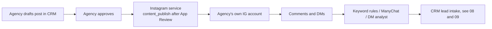

# 13 — AI Marketing Architecture

> **Status (17 Sep 2026):** As built + roadmap. Checked against the code on main. Paths moved in the repo reorganisation; the tenant marketing agent is dropped (D14), tenant publishing waits for Meta App Review, and the marketing decisions D22–D29 are deferred by the founder.

> **Scope:** two different things that both get called "marketing": (1) the founder's own GTM tooling used to sell RealEstateFlow, and (2) marketing features inside the product for agencies. This doc records what exists for each and what is still open. Related: `06` (skills), `08` (lead acquisition), `17` (credits), `39` (WhatsApp official API).

---

## 1. Founder GTM tooling (internal, not a product feature)

| Piece | Where | What it is |
|---|---|---|
| Agent and skill library | `tools/claude-skills/` (`agents/`, `skills/`, `scripts/`) | Claude Code agents and skills for creative, ads, outreach and research |
| MCP servers | `.mcp.json`: `higgsfield`, `meta-ads`, `blotato`, `nabi-crm`, `git` | Image and video generation (Higgsfield), Meta ads management, social scheduling (Blotato), the CRM MCP server, git |
| Scripts | `tools/claude-skills/scripts/`: `generate-image.ps1`, `render-remotion.ps1`, `elevenlabs-tts.ps1`, `serpapi-scrape.ps1`, `sheets-update.ps1`, `validate-ad-budget.sh` | Image generation, Remotion renders, voiceovers, Google Maps scraping, pipeline sheet, ad budget guard |
| Programmatic video | `marketing-and-sales/video-projects/my-video/` | Remotion project for templated, brand-locked videos |
| Brand kit | `marketing-and-sales/creative/realestateflow-launch/brand-kit.md` | v3 "Bazaar Signal": ink `#1C1512`, paper `#FBF2E4`, marigold `#FF7A1A`, gulal `#FF3D7F`, tulsi `#1FAA59` (sparing); Unbounded + Manrope |
| GTM playbook | `marketing-and-sales/launch-plan-v2/` (Content OS being merged into it, D2) | Launch plan, content system, pricing file |
| Founder Instagram lead workbook | `tools/kalim-sessions/kalim-automations/hp-insta-lead-automation/` | Laptop pipeline that turns the founder's own DMs into scored rows in an Excel workbook |
| Marketing site | `apps/landing-pages/` (S3 + CloudFront) | realestateflow.in |

Rules that already apply to all marketing output: Hinglish copy follows the CLAUDE.md convention (70% English, 30% romanized Hindi); the v3 brand kit above; and no fake proof. RealEstateFlow is pre-launch with no customers, so there are no testimonials, customer counts or case studies, and the AI presenter is never shown as a real customer or broker. The founder does not appear on camera.

> Open decision D22 — see marketing-and-sales/launch-plan-v2/00-OPEN-DECISIONS.md (scheduling tool: whether Blotato stays).

> Open decision D24 — see marketing-and-sales/launch-plan-v2/00-OPEN-DECISIONS.md (city, language mix and ICP for marketing; `00-DECISIONS-LOG.md` records ads/social at 60/25/15 EN/Hinglish/Marathi, which differs from the CLAUDE.md 70/30 rule).

## 2. Marketing-related features in the product (as built)

| Feature | Where | Status |
|---|---|---|
| **Per-tenant Instagram connection** | `apps/instagram/backend_insta_sol_ms` | Instagram Login OAuth with scopes `instagram_business_basic`, `_manage_messages`, `_manage_comments`, `_manage_insights`. DM inbox and replies, comment keyword rules (`services/ruleMatcher.js`), media and insights, enquiries forwarded to the CRM (`services/crmBridge.js`). All outbound messages pass the Meta messaging-window gate (`services/windowPolicy.js`). Deployed to dev; Meta App Review and prod pending. |
| **Content publishing** | same service | Not built on purpose. `content_publish` is deliberately not requested, to keep App Review simple (`config/env.js`). |
| **Token storage** | `apps/instagram/backend_insta_sol_ms/services/metaSecurity.js` | Instagram access tokens stored AES-256-GCM encrypted in DynamoDB (not Secrets Manager). |
| **Public property pages** | `apps/property-pages-ms` | Tenant-branded listing pages with site-visit booking. |
| **ManyChat comment-to-DM** | `docs/property-pages/02-MANYCHAT-SETUP.md` | Comment keyword sends a DM with a property-page link; leads arrive through the `manychat` intake adapter. |
| **Credits** | `apps/crm/server/creditConfig.js`, `creditService.js`, `middleware/meterCredits.js` | Credit ledger exists. No marketing actions are metered because none exist in the product. |

Not built: a Marketing MCP, image / reel / copy generation for tenants, social scheduling for tenants, Meta Conversions API (offline conversion upload), per-tenant brand kits (no model in the CRM).

Note: `docs/insta-sol-ms-docs/02-FEATURES.md` lists publishing as done in Phase 4. The code does not request the publishing scope, so that entry should read "planned".

## 3. Founder decisions that shape this doc

- **D14 keep:** tenant social publishing, **after Meta App Review** passes. The likely route is adding `content_publish` to the Instagram service in a separate review, but the method is not fixed.
- **D14 drop:** the tenant marketing agent (a "make me 3 reels and schedule them" agent for agencies). Also dropped: posting to property portals through browser automation (account-block risk) and Telegram (no code; remove it from copy).
> Open decision D26 — see marketing-and-sales/launch-plan-v2/00-OPEN-DECISIONS.md (which AI features marketing may show). Until it is settled, the no-fake-proof rule still applies: features that are not built or not live (tenant publishing, AI calling) are not presented as available.

> Open decision D23 — see marketing-and-sales/launch-plan-v2/00-OPEN-DECISIONS.md (marketing channels).

> Open decision D29 — see marketing-and-sales/launch-plan-v2/00-OPEN-DECISIONS.md (analytics, referrals, WhatsApp to prospects).

## 4. Tenant social publishing (roadmap, Phase C)

What is kept, at the level of principles only:

- Each agency publishes to **its own** accounts through its own connection. The existing Instagram OAuth connection is the starting point.
- Nothing posts publicly without the agency approving it first.
- Claims must be accurate: real prices and specs from the CRM, RERA-aware wording, no invented offers.
- Any generated asset or post that costs money to produce is credit-metered; units are not defined yet and pricing is being re-planned (`38`).

> **Open question:** is publishing done directly through the Instagram Graph API or through an aggregator? Tied to D22 for the founder's own scheduling; not decided for tenants.

## 5. Considered in June, not adopted

- A tenant-facing Marketing Agent (Sonnet) exposed through a Marketing MCP with `generate_image`, `generate_reel`, `generate_copy`, `create_campaign`, `schedule_post` (dropped by D14).
- Wrapping the founder's Higgsfield, Meta-Ads and Blotato MCPs as tenant features.
- Per-tenant Meta / IG / Blotato credentials in Secrets Manager (the built service encrypts tokens in DynamoDB instead).
- Closed-loop Meta CAPI optimisation, autonomous content calendars and a "marketing copilot" tier.

## 6. KPIs

For the founder GTM: see the launch playbook in `marketing-and-sales/launch-plan-v2/`. For the product: Instagram enquiries per connected account, enquiry → CRM lead rate, comment-rule hits, and (after publishing ships) posts approved and published per tenant.
