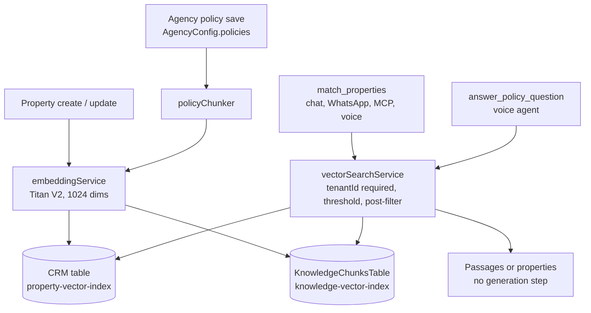

# 14 — RAG & Knowledge Architecture

> **Status (17 Sep 2026):** As built + roadmap. Checked against the code on main. The June plan (Bedrock Knowledge Bases on S3 Vectors) was not built; knowledge retrieval is DynamoDB vector search with Titan Text Embeddings V2 inside the CRM backend, and Bedrock invocation now works in the dev account.

> **Scope:** the tenant-scoped retrieval layer that grounds agent answers in agency knowledge and property descriptions. Design record: `docs/proposals/agent-channel-architecture/05-retrieval-and-vector-search.md`. Related: `09`, `12`, `15`, `16`.

---

## 1. Why a knowledge layer

Agents must answer from real data, never invent it. Structured facts (price, availability, bedrooms) come live from the CRM. Retrieval covers the text that doesn't fit a filter: agency policies and FAQs, and prose descriptions of what a buyer wants ("spacious, near the station, needs parking").

## 2. What is built

Two vector indexes, one embedding model, one shared query path. All code is in `agency-app/api/services/`.

| Piece | Property matching | Policy knowledge |
|---|---|---|
| Source of truth | Property items in the CRM table | `policies` array on the agency's `AgencyConfig` item (`knowledge/policyStore.js`) |
| Vectors stored in | Same CRM table, attribute `descriptionVector` | Separate `KnowledgeChunksTable`, attribute `contentVector`; keys `PK = TENANT#{tenantId}#DOC#{policyId}`, `SK = CHUNK#00000` |
| Vector index | `property-vector-index` | `knowledge-vector-index` |
| Search schema | `tenantId` HASH; inline filters `EntityType`, `propertyType` | `tenantId` HASH; inline filter `category` (`faq`, `policies`, `agency_info`, `pricing`) |
| Distance | COSINE, 1024 dims | COSINE, 1024 dims |
| Written when | On property create and update (`crmDynamodbService.js` → `embeddings/propertySearchService.js`), skipped when the embedding source hash is unchanged | On every policy save (re-index is idempotent, skips unchanged documents) |
| Backfill / repair | `agency-app/api/scripts/backfill-property-embeddings.js` | `agency-app/api/scripts/reindex-policies.js`, or `POST /api/crm/agency-policies/reindex` |
| Score threshold | `VECTOR_SCORE_THRESHOLD`, default 0.55 | fixed 0.55 (`POLICY_SCORE_THRESHOLD`) |
| Read API | `matchProperties` (`match_properties` tool) | `answerPolicyQuestion` → `POST /api/internal/policies/answer` |

**Embeddings** (`embeddings/embeddingService.js`): Amazon Titan Text Embeddings V2 (`amazon.titan-embed-text-v2:0`) through Bedrock `InvokeModel`, 1024 dimensions, `normalize: true`, input capped at 8,000 characters. It is the only embeddings provider in the code, and the only Bedrock call in the codebase. Model and dimension are immutable once an index exists: changing either means delete, recreate and re-embed. Each item records `embeddingSourceHash` and `embeddingModel` so stale vectors can be found. An embedding failure never fails the business write; the item is saved without a vector and picked up by the next backfill.

**Chunking** (`knowledge/policyChunker.js`): the paragraph is the unit, and paragraphs are not packed together to reach a size. A paragraph longer than 1,000 characters is split on sentence boundaries into pieces of about 700 characters, with one sentence of overlap. Headings and list lines (100 characters or less, no closing punctuation) are attached to the rule that follows them, up to about 700 characters. The document title is prefixed to each chunk for embedding but stored separately. Properties are not chunked: one embedding per property built from labelled fields (title, description, type, BHK, area, city, building, furnishing, amenities, price or rent). Owner name, phone, flat number and exact address are excluded on purpose.

**Retrieval** (`embeddings/vectorSearchService.js`): the one query path for every channel. It embeds the query, calls DynamoDB `SearchVectors` with `tenantId` in the condition (the call fails without it), over-fetches 4× (max 100) because inline filters are equality-only, drops results above the distance threshold, then post-filters ranges (price, bedrooms, status) in code. Retrieval errors return no results rather than throwing, so a live call hears "I don't know, let me get a human" instead of a broken tool.

**No generation step.** Policy search returns passages (up to 3, joined to ≤900 characters, with source document titles), not a written answer. The voice agent's own LLM phrases the reply, which avoids a second LLM round trip while the caller waits (`knowledge/policySearchService.js`).

**Limits on policy text** (`knowledge/policyStore.js`): at most 50 policies, 20,000 characters each, 150,000 in total, so the `AgencyConfig` item stays under DynamoDB's 400 KB limit.

**Index creation:** CloudFormation cannot declare DynamoDB vector indexes. `KnowledgeChunksTable` is in `agency-app/api/infra/cfn-backend.yaml`; both indexes are created by `agency-app/api/infra/create-vector-index.sh <dev|prod>` (`create-vector-index.mjs`). Whether the indexes and backfills have been run in each environment is not recorded in the repo.

## 3. Who uses it

| Consumer | Uses | Path |
|---|---|---|
| AI voice agent | Property matching and policy answers | ElevenLabs tools → `agency-app/ai-calling/src/services/crmApiService.js` → `POST /api/internal/properties/match`, `POST /api/internal/policies/answer` (`agency-app/api/routes/aiCallingInternal.js`) |
| WhatsApp staff agent, web CRM chat | Property matching | `match_properties` tool from `agency-app/api/shared/toolDefinitions.js`, run in-process |
| External AI clients (MCP) | Property matching | Same tool, exposed by `platform/mcp` |
| Agency admins | Write and re-index policies | `agency-app/api/routes/agencyPolicies.js` (read: members; save and re-index: admin/manager) |

Policy answers are only wired to the voice agent today; there is no policy tool in the chat tool registry. `agency-app/ai-calling` has no Bedrock grant and reaches knowledge only through the CRM.

File uploads to the calling service (`/api/ai-calling/knowledge/*`) are stored but **not indexed**: `/confirm` returns 501 and the API tells users to enter policy text in the CRM (`agency-app/ai-calling/src/routes/knowledge.js`).

## 4. Architecture

## 5. Bedrock status (D12)

- On 3 Sep 2026 Bedrock `InvokeModel` was refused on the AWS account, including for Titan embeddings, while an account-verification case was open (`docs/agency-app/ai-calling/AWS-CASE-178749035000906-BEDROCK-REPLY.md`).
- On 17 Sep 2026 `aws bedrock-runtime invoke-model` succeeded in the **dev** account (730335176275, ap-south-1) for `amazon.titan-embed-text-v2:0` (1024-dim) and `global.anthropic.claude-haiku-4-5-20251001-v1:0`. The block is resolved for dev.
- The **prod** account (532404260898) has not been re-tested. Check it before running prod backfills.

## 6. Multi-tenancy and security

- `tenantId` is the HASH key of both vector search schemas, so AWS rejects a search without it; `vectorSearchService.js` also throws early if it is missing.
- Tenant comes from the authenticated request or the internal-API header, never from model arguments (`15`).
- Vector attributes are stripped from results before they reach a prompt.
- Property embeddings exclude owner identity fields.

## 7. Knowledge domains

| Domain | Status | Consumer |
|---|---|---|
| Agency policies, FAQs, agency info, pricing notes (typed text) | Built | Voice agent |
| Property descriptions | Built | Voice, WhatsApp staff agent, web chat, MCP |
| Brochures, floor plans, RERA PDFs | Not built (uploads are not indexed) | — |
| Sales playbooks, objection handling | Not built | — |
| Marketing knowledge (brand kit, approved claims) | Not built | — |

Brochure and floor-plan tools stay on the roadmap (D14, Phase C).

> **Open question:** should PDF and brochure text be extracted into the same `KnowledgeChunksTable`, or should brochure tools only link to assets on property pages? Not decided.

## 8. Considered in June, not adopted

- Bedrock Knowledge Bases (`RetrieveAndGenerate`, metadata filters, citations) as the platform standard.
- S3 Vectors as the backing store; Aurora pgvector if Aurora were adopted (Postgres is parked, D8); OpenSearch Serverless (floor cost).
- A separate Knowledge MCP server (`query_knowledge`, `list_sources`, `ingest_document`).
- Hybrid keyword + vector search inside the store. DynamoDB supports only equality inline filters, so the built design uses filters plus post-filtering instead.

## 9. KPIs

Share of properties and policies with a current embedding, policy "no answer" rate on calls (healthy, not zero), retrieval relevance on a test set, re-index lag after a policy edit, Bedrock embedding errors per day.

## 10. Phasing

- **Phase A:** confirm vector indexes and backfills in each environment; re-test Bedrock in prod.
- **Phase C:** brochure / floor-plan tools; decide on document ingestion; consider a policy tool for chat channels.
