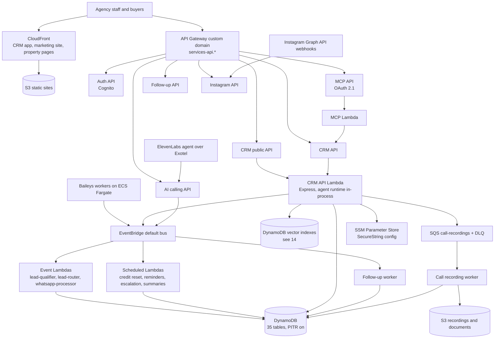

# 16 — Infrastructure Architecture

> **Status (17 Sep 2026):** As built + roadmap. Checked against the code on main. The June "target topology" is replaced by the infrastructure that actually exists: 17 CloudFormation templates, 12 deploy wrappers, Lambda behind two API Gateways on shared custom domains, 35 DynamoDB tables, EventBridge, SQS, CloudFront and one ECS Fargate service. Redis, Step Functions, Aurora, OpenSearch, AgentCore and OpenTelemetry are still not built; Postgres is parked (D8).

> **Scope:** the AWS estate — accounts, region, stacks, compute, data stores, the event backbone, frontends, deploys and observability. Security posture and the hardening backlog are in `15`. Cost is in `17`. Retrieval storage is in `14`.

---

## 1. Shape today

RealEstateFlow is a managed-serverless estate in **one region, `ap-south-1` (Mumbai)**, across two AWS accounts. Almost everything is Lambda behind API Gateway, with DynamoDB as the source of truth and S3 for files and build archives. The only long-running compute is one ECS Fargate service (the Baileys WhatsApp workers). There is no Kubernetes, no relational database, no cache tier and no service mesh.

The design rule has not changed: **every component has to earn its operational cost.** The team is a solo founder plus AI agents and contractors (D20), so idle floors (OpenSearch Serverless, EKS control plane, an always-on Redis) are avoided until load justifies them.

## 2. Accounts, region, domains

| | Dev | Prod |
|---|---|---|
| Account | `730335176275` (profile `cloudberry-main`) | `532404260898` (profile `cloudberry-prod-new`) |
| Region | `ap-south-1` | `ap-south-1` |
| Shared API domain | `services-api.cloudberrysolutions.in` | `services-api.realestateflow.in` |
| Artifact bucket | `dev-realestateflow-artifacts` | `prod-realestateflow-artifacts` |

Every backend service maps its own API Gateway onto the **one shared custom domain per environment** under its own base path, for example the CRM API at `/devrealestatecrm`. The deploy scripts refuse raw `execute-api` hostnames and refuse the wrong domain for the environment (`agency-app/web/infra/lib/api-domain-guard.sh`, `agency-app/ai-calling/infra/deploy.sh`).

Public web domains: `app.realestateflow.in` (CRM app), `realestateflow.in` (marketing site), `pages.realestateflow.in` (tenant property pages), `properties.realestateflow.in` (cross-tenant marketplace).

**Account caveats.** The prod account is not verified for CloudFront: new distributions fail there, so `ENABLE_CLOUDFRONT=false` is the documented workaround (`public-app/property-pages/README.md`, `docs/agency-app/instagram/09-CLOUDFRONT-INTEGRATION.md`). Bedrock invocation was refused on the same verification case; on 17 Sep 2026 it succeeded again in **dev**, and prod has not been re-tested (D12, `14`).

## 3. Stacks

17 CloudFormation templates live next to the service they belong to, under `apps/*/infra/` or `services/*/infra/`. Twelve of them have a deploy wrapper at `infra/cicd/<service>/deploy.sh`.

| Service | Template | Wrapper | What the stack creates |
|---|---|---|---|
| CRM backend | `agency-app/api/infra/cfn-backend.yaml` | `infra/cicd/agency-app/api` | 13 Lambdas, 2 REST APIs + 4 nested route stacks, 18 DynamoDB tables, 11 EventBridge rules, 2 SQS queues, 1 S3 bucket, 8 alarms, 1 dashboard, SNS topic |
| CRM API routes | `apigw-explicit-routes-part1.yaml`, `-part2.yaml` | (nested) | API Gateway resources and methods, split because one stack exceeded the resource limit |
| CRM launch tables | `agency-app/api/infra/launch-tables-cfn.yaml` | `infra/cicd/agency-app/launch-tables` | 6 tables: grievances, webhook-log, tenant-api-keys, subscriptions, nps-responses, beta-invites |
| CRM frontend | `agency-app/web/infra/cfn-frontend.yaml` | `infra/cicd/agency-app/web` | S3 + CloudFront + OAC + CloudFront Function + Route 53 record |
| Marketing site | `agency-app/landing-pages/infra/cfn-landing-pages.yaml` | `infra/cicd/agency-app/landing-pages` | S3 + CloudFront + response-headers policy (CSP, HSTS) + 2 Route 53 records |
| Property pages | `public-app/property-pages/infra/cfn-property-pages.yaml` | `infra/cicd/public-app/property-pages` | Lambda, REST API, CloudFront with cache/origin-request policies, `pages-guard` table |
| Instagram API | `agency-app/instagram-api/infra/cfn-insta-sol-ms.yaml` | `infra/cicd/agency-app/instagram-api` | Lambda, REST API (throttled), 2 tables, 1 scheduled sync rule |
| Instagram console | `agency-app/instagram-web/infra/cfn-insta-frontend.yaml` | `infra/cicd/agency-app/instagram-web` | S3 bucket only — served at `/insta/` from the CRM frontend's distribution |
| Auth | `platform/auth/infra/cfn-backend.yaml` (+ `auth-explicit-routes.yaml`) | `infra/cicd/platform/auth` | Cognito user pool, domain, client, IdP, branding; 4 Lambdas; 3 tables; REST API with access logging |
| MCP server | `platform/mcp/infra/cfn-backend.yaml` | `infra/cicd/platform/mcp` | 2 Lambdas, REST API with a Lambda authorizer, 2 OAuth tables |
| AI calling | `agency-app/ai-calling/infra/cfn-ai-calling.yaml` | `infra/cicd/agency-app/ai-calling` | Lambda, REST API, 1 table, knowledge + recordings buckets, 1 Secrets Manager secret |
| Follow-up agent | `agency-app/followup-agent/infra/cfn-followup.yaml` | `infra/cicd/agency-app/followup-agent` | 2 Lambdas, REST API, 1 table, 4 EventBridge rules, SQS DLQ, 2 alarms, 1 secret |
| WhatsApp platform | `platform/whatsapp-platform/infra/cfn-platform.yaml` | `infra/cicd/platform/whatsapp-platform` | ECS cluster + Fargate service + task definition, session table, session bucket, KMS key, 6 alarms, 4 log metric filters, 3 rules, 1 secret |
| Shared VPC + artifacts | `infra/cicd/common-infra/vpc-networking.yaml` | *(none)* | VPC, public/app/data subnets, tier security groups, the per-environment artifact bucket |

`agency-app/api/infra/apigw-explicit-routes.yaml` is a source file for the part1/part2 splitter, not a deployed stack. `apps/onboarding` has no template: it is a local-only tool that writes a tenant row into the AgencyConfig table.

Known drift, from the 2026-08-12 account audit (`infra/cicd/README.md`): the launch-tables stack has never deployed cleanly — it collided with a table the CRM stack already owns — so five of those tables exist in the account without a stack owning them, and `beta-invites` does not exist at all.

## 4. Topology

## 5. Compute

- **Lambda** runs everything except the WhatsApp transport: the CRM API (one Express handler behind both REST APIs), event handlers, scheduled jobs, the MCP server, auth, the calling service, the follow-up worker, the Instagram sync worker and the property-pages renderer. Agents run **inside** the CRM API Lambda and inside the qualifier / router Lambdas, calling CRM tools in-process through `agency-app/api/skillInvoker.js` — not over MCP.
- **ECS Fargate** runs only `platform/whatsapp-platform`, the self-hosted Baileys workers, on a `FARGATE_SPOT` / `FARGATE` capacity-provider strategy in the shared VPC's private subnets. The voice bridge needs no container: ElevenLabs hosts the agent and connects to Exotel directly (`agency-app/ai-calling/README.md`).
- **No EKS, no EC2.** Nothing has changed the June verdict: the control-plane fee is the cheap part, and the ops load is not affordable at this team size.

## 6. Event backbone

Everything runs on the **default EventBridge bus** — no custom bus. There are 11 rules in the CRM stack, 4 in the follow-up service and 1 in the Instagram service.

| Event | Source / detail-type | Consumer |
|---|---|---|
| Lead created | `crm.leads` / `lead.created` | `lead-qualifier` Lambda; follow-up service |
| Lead qualified | `crm.leads` / `lead.qualified` | `lead-router` Lambda |
| Meeting completed / cancelled | `crm.meetings` | Follow-up service |
| Call ended | `aicalling.calls` / `call.ended` | Follow-up service |
| WhatsApp message received | `whatsapp.incoming` / `message.received` | `whatsapp-processor` Lambda |

Scheduled rules: credit reset (`cron(30 18 * * ? *)`), trial reminder, incomplete-data nudge, expiring agreements, team summary, stale-lead follow-up, AI Employee escalation (`rate(6 hours)`), meeting reminder (`rate(5 minutes)`) and the follow-up dispatch tick (`rate(5 minutes)`).

**SQS** is used for the call-intelligence pipeline: a `call-recordings` queue with a 14-day DLQ feeds the recording worker, and the follow-up service has its own DLQ. Alarms watch both DLQ depth and queue backlog.

**Not built:** Step Functions (the follow-up engine is a DynamoDB job table plus the 5-minute tick) and Redis / ElastiCache. Deduplication is done with DynamoDB conditional writes instead (`agency-app/api/whatsappConversationService.js`). The shared VPC template reserves a cache subnet tier and security group, so adding ElastiCache later is a stack change, not a redesign.

## 7. Data

- **DynamoDB is the source of truth.** 35 tables are declared across the stacks: 18 in the CRM backend stack, 6 launch tables, 3 auth, 2 MCP OAuth, 2 Instagram, and one each for calling, follow-up, property-pages and WhatsApp sessions. Point-in-time recovery is on; the main tables carry `DeletionPolicy: Retain`.
- **Vector search** runs on DynamoDB indexes over the CRM table and `KnowledgeChunks`, with `tenantId` as the required HASH key (`14`, `15 §5`).
- **S3** holds: the CRM documents and call-recordings bucket (public access blocked, SSE-S3, versioning `Suspended`, no expiry rule — customer records are never deleted), the calling service's knowledge and recordings buckets, the WhatsApp session bucket, the static-site buckets, and the per-environment artifact bucket that every deploy archives into.
- **Configuration and secrets:** about 100 CRM values in SSM Parameter Store SecureString, loaded at cold start; one Secrets Manager secret each for the calling, follow-up and WhatsApp stacks (`15 §6`).
- **Postgres is parked (D8).** No `pg`, `knex` or RDS resource exists anywhere. Credits, the agent audit trail and grievances — all of which docs `25`–`27`/`30` planned for Postgres — were built on DynamoDB. If ad-hoc reporting ever outgrows DynamoDB, the direction is an event-fed Aurora Serverless v2 **projection**, never a CRM replacement, and there is no date on it.
- **OpenSearch stays deferred.** The serverless floor is still a tax before scale; DynamoDB vector search covers retrieval today.

## 8. Frontends and CDN

The CRM app and the marketing site are S3 behind CloudFront: an Origin Access Control on the bucket, a CloudFront Function for SPA routing or path rewriting, and Route 53 records created in-stack. The property-pages distribution is different — it fronts the service's API Gateway, because those pages are rendered per request, so it carries a cache policy and an origin-request policy instead of a bucket, and no Route 53 record of its own. The Instagram console is a bucket only, mounted under `/insta/` on the CRM distribution — which is why finishing its prod wiring depends on the CRM frontend stack being deployed in prod first.

`netlify.toml` files still sit in `agency-app/web/` and `agency-app/landing-pages/`. Netlify was the original host and is not the deploy path any more; CloudFront is. The landing-pages CFN response-headers policy reimplements what `netlify.toml` used to set.

## 9. Deploys and CI (D19)

**Deploys stay manual**, through `infra/cicd/<service>/deploy.sh <env>`. Each wrapper does the same job:

- delegates the real packaging and CloudFormation work to the service's own `infra/deploy.sh`;
- records a **numbered build** with a manifest, archiving the template and parameters to `s3://<env>-realestateflow-artifacts/<service>/builds/<build>/<env>/` where they are never overwritten;
- tags every object it touches with `Branch`, `DeployDate`, `Status` and `CommitId`;
- supports `list`, `show`, `rollback-code` (repoint the Lambda at an old build) and `rollback-full` (redeploy that build's template and parameters). A rollback is always a new forward build, never an edit to history;
- the CRM backend also has `config-deploy` / `rollback-config` for SSM-only changes with no CFN or zip step.

Before a deploy, the `cfn-cicd-deploy` skill runs the read-only `cfn-readiness-auditor` over the template, deploy script and env files; anything blocking stops the deploy and needs sign-off. Prod deploys need explicit sign-off regardless.

**GitHub Actions runs tests only** — there is no deploy job. The four workflows are `server-tests.yml`, `insta-sol-ms-tests.yml` (which also runs `bash -n` over the deploy scripts and `npm audit`), `playwright.yml` and `pr-intelligence.yml` (manual dispatch). A GitHub Actions deploy to **dev** comes later (D19); prod stays manual.

Two live deploy hazards are written up in `docs/pending-items/deploys-and-branches.md`: build numbers come from a local gitignored counter, so two checkouts can both produce "0001", and a frontend deploy replaces the whole site, so deploying from a stale branch silently reverts other people's work. Until the counter moves to the artifact bucket, check the newest object under `s3://dev-realestateflow-artifacts/<service>/builds/` and read its `Branch` and `CommitId` tags before deploying.

**IaC rule:** CloudFormation only — no Terraform, CDK, Pulumi or SAM (`README.md`). Per-service templates behind the wrappers; consolidation into one mega-stack is not the plan. Runtime rollout is controlled by `agency-app/api/featureToggleService.js` (`ai_qualification`, `ai_routing`, `ai_followup`, …) plus per-tenant `aiEmployeeEnabled` and provisioning gates, not by deploy-time branching.

## 10. Observability

Built:

- **CloudWatch alarms** — 8 in the CRM stack (API Lambda errors, WhatsApp processor errors / throttles / slowness, call-recording DLQ not empty, call-recording backlog, recording-worker errors, CRM table throttling), 2 in the follow-up stack, 6 plus 4 log metric filters in the WhatsApp platform stack. Alarms notify an SNS topic.
- **A CloudWatch dashboard**, `${Env}-realestateflow-ops`.
- **Custom metrics** from `agency-app/api/observability/cloudwatch.js` and `phase2Metrics.js`.
- **Sentry** (`agency-app/api/lib/sentry.js`) and **PostHog** (`lib/posthog.js`).
- **X-Ray tracing** enabled on the calling and follow-up API stages.
- **LLM audit** rows in the `AgentAudit` table (`agents/agentAuditService.js`) — with a 90-day TTL that D17 replaces with archiving.

Not built: OpenTelemetry / ADOT (the only `@opentelemetry` entry is a transitive Sentry dependency), Langfuse, AgentCore Observability, and API Gateway access logs on any stage except auth.

## 11. Hardening gaps (D17)

These are infrastructure-side items; the full list and reasoning are in `15 §8`.

| Item | State | When |
|---|---|---|
| API Gateway throttling on the CRM APIs | Not set. `MethodSettings` throttles exist only on the Instagram and property-pages stages; CRM rate limiting is an in-memory Express limiter that does not hold across Lambda containers | Before paid launch |
| API Gateway access logs on the CRM APIs | Only the auth stack has `AccessLogSetting` | Before paid launch |
| Gateway-response CORS | 5 CRM gateway responses still return `Access-Control-Allow-Origin: '*'` | Before paid launch |
| Server-enforced read-only after grace | `agency-app/api/scripts/grace-period-expiry-cron.js` exists but no EventBridge rule schedules it | Before paid launch |
| WAF | No `AWS::WAFv2` in any template | After first customers |
| Agent audit retention | 90-day TTL delete; archive instead — never delete CRM data | Phase B |
| Launch-tables stack drift | Five tables unowned by any stack, `beta-invites` missing | Phase B |
| S3 versioning on the documents bucket | `Suspended` — open question in `15 §6` | Not decided |

## 12. Cost posture

Detail is in `17`. The shape: serverless plus scale-to-zero keeps idle cost near the floor, and the two always-on floors the June plan would have added — OpenSearch Serverless and EKS — are still avoided. The one steady cost is the Fargate WhatsApp service, kept on Spot by default. Dominant variable costs are LLM calls (Gemini flash tiers today, behind the model gateway), voice minutes, and CloudFront plus S3 egress.

## 13. Phasing

- **Phase A (M1 launch).** Close the hardening items above; fix the launch-tables stack drift; make build numbers global by reading the artifact bucket; get the CRM frontend and Instagram service into prod once the CloudFront account verification clears.
- **Phase B (hardening).** WAF after the first customers; archive audit rows instead of TTL delete; IAM clean-up; a GitHub Actions deploy to dev.
- **Phase C (growth).** Revisit a cache tier only if dedup or rate limiting actually needs one; revisit an Aurora reporting projection only if reporting outgrows DynamoDB; revisit OpenSearch only if the search floor is justified by volume.

## 14. Considered in June, not adopted

- **EKS** — rejected then, still rejected.
- **Redis / ElastiCache Serverless** for dedup, rate limits and session cache — DynamoDB conditional writes cover dedup; the VPC keeps a cache tier reserved.
- **Step Functions** for follow-up journeys — the shipped engine is a DynamoDB job table plus a 5-minute EventBridge tick (`09`, `12`).
- **Aurora Serverless v2 as a reporting projection with RLS** — parked, no date (D8).
- **Strands agents and Bedrock AgentCore Runtime / Gateway / Browser** — the agent runtime is in-house behind a model gateway (`04`, D7).
- **Bedrock Knowledge Bases and S3 Vectors** for RAG — retrieval is DynamoDB vector search (`14`).
- **Chatwoot on Fargate** as the channel hub — no code ever existed; channels are Baileys (staff), the Instagram Graph API, and later the official WhatsApp Cloud API (`39`).
- **Browser-automation workers on Fargate** for portal posting — dropped for account-block risk (D14).
- **Consolidated IaC in SAM or CDK, and an automated deploy pipeline with approvals** — CloudFormation only, manual wrappers (D19).
- **OpenTelemetry / ADOT and Langfuse** for LLM tracing — CloudWatch, Sentry and PostHog today.
