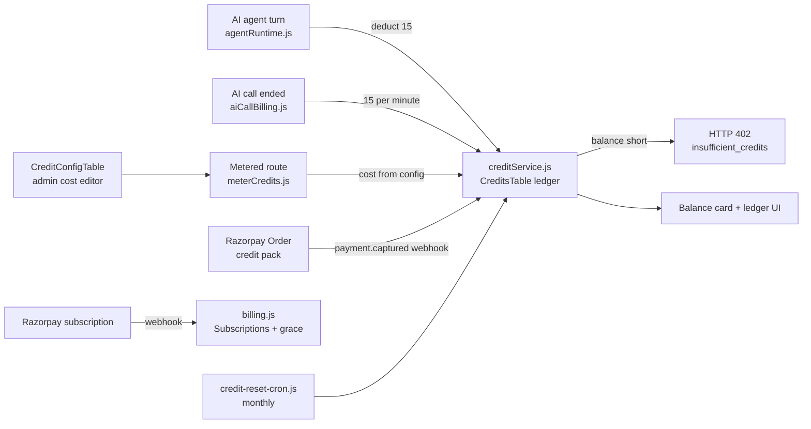

# 17 — Cost & Billing Architecture

> **Status (17 Sep 2026):** As built + roadmap. Checked against the code on main. The June design (Lago meter, Starter/Growth/Pro tiers, Haiku/Sonnet cost levers) is replaced by the credit ledger, metering and Razorpay billing that are actually in the CRM; pricing itself is being re-planned in doc 38.

> **Scope:** how RealEstateFlow bills agencies for AI work and how it meters that work internally. The code is the spec; this doc explains it and lists the gaps. Payment gaps in detail: `29-payment-system-implementation.md`. Metering internals: `30-credits-metering-implementation.md`.

---

## 1. Principle

Customers are **not billed per token**. The rule in code is **"humans work for free, AI costs credits"** (`agency-app/api/creditConfig.js`, comment above `COSTS`):

- Every manual CRM action (adding a lead, contact, property, khata entry, editing a record) costs 0 credits.
- Credits are spent only when AI does work for the tenant: an AI agent turn or an AI phone call.
- **1 credit = ₹1**, so an agency can read spend in rupees.

## 2. What Is Built

| Piece | What it does | Evidence |
|---|---|---|
| Subscriptions | Razorpay subscriptions; webhook handles charge, failure, cancel, halt, seat changes; events de-duplicated through a webhook log | `agency-app/api/routes/billing.js`, `agency-app/api/webhookLogService.js` |
| Trial | 14 days by default (`TRIAL_DAYS`), created on first visit, with 1,000 starter credits | `agency-app/api/subscriptionService.js`, `agency-app/api/routes/subscriptions.js` (`/trial-status`) |
| Paywall + trial banner | Shown after trial expiry unless paying or in grace | `agency-app/web/src/components/PaywallModal.tsx`, `TrialCountdownBanner.tsx` |
| Seat caps | Seat check endpoint; seats paid/used kept in step with Razorpay quantity changes | `agency-app/api/routes/subscriptions.js` (`/check-seat`), `routes/billing.js` |
| Grace period | `payment.failed` gives a paying tenant 7 days (`GRACE_PERIOD_DAYS`) and emails the founder | `agency-app/api/routes/billing.js` |
| Grace expiry | Script that ends grace and suspends AI Employee provisioning | `agency-app/api/scripts/grace-period-expiry-cron.js` (**not scheduled**, see §7) |
| Credit ledger | Balance row + ledger rows per tenant in one DynamoDB transaction; HTTP 402 when balance is short | `agency-app/api/creditService.js`, `CreditsTable` in `agency-app/api/infra/cfn-backend.yaml` |
| Metering | Per-route middleware and helpers; a cost of 0 short-circuits | `agency-app/api/middleware/meterCredits.js` |
| Agent turn charge | 15 credits deducted before the turn, refunded if the turn fails without a CRM write | `agency-app/api/agents/agentRuntime.js` (`AGENT_ACTION_CREDITS`, `refundCredits`) |
| AI call charge | 15 credits per started minute, from the settled duration on the post-call webhook | `agency-app/api/aiCallBilling.js`, `routes/aiCallingInternal.js` |
| Monthly reset | Scheduled Lambda resets monthly credits on the billing anniversary | `agency-app/api/scripts/credit-reset-cron.js`, `CreditResetFunction` schedule in `cfn-backend.yaml` |
| Top-up packs | One-time Razorpay Orders; `payment.captured` grants the credits | `agency-app/api/razorpayOrders.js`, `routes/subscriptions.js` (`/credits/purchase`), `routes/billing.js` |
| Balance + ledger UI | Balance card, ledger endpoint, buy-credits modal | `CreditBalanceCard.tsx`, `BuyCreditsModal.tsx`, `routes/subscriptions.js` (`/credits`, `/credits/ledger`) |
| Admin cost editor | Platform operators change costs, packs and free tier without a deploy (60 s config cache) | `agency-app/api/routes/creditAdmin.js` (mounted at `/api/credit-config`), `CreditConfigTable` |

### Live credit costs (defaults in `creditConfig.js`)

| Action key | Credits | Notes |
|---|---|---|
| `agent_action` | 15 | One AI agent turn. Covers AI WhatsApp replies and the text lead qualifier |
| `ai_call_per_minute` | 15 | Per started minute of a completed AI call |
| `lead_add`, `contact_add`, `property_add`, `owner_add`, `tenant_add`, `khata_entry`, `record_update` | 0 | Manual work is free |
| `whatsapp_send`, `email_send`, `bulk_import_per_record`, `analytics_report` | 0 | Kept at 0 so the call sites keep working and a cost can be switched on from the admin editor |

There is no meter for marketing images/reels or portal automation, because those features are not built.

## 3. Pricing Today

Current (pre-launch) pricing is in `marketing-and-sales/launch-plan-v2/pricing.json` and CRM `agency-app/web/src/lib/plans.ts`, which disagree on Team+. It is being replaced by the proposal in `docs/realestateflow-vision/38-pricing-plan-contacts-and-credits.md` (Proposed: plans limited by number of properties + AI credits, property search does not use AI credits, and a new "Contacts" unit for leads contacted).

The facts below are recorded so the mismatch is visible. None of them is a final price.

| Item | `pricing.json` | `plans.ts` / CRM code |
|---|---|---|
| Solo | ₹999/mo, 1 seat | ₹999/mo, 1 member |
| Team | ₹1,999/mo, 3 seats | ₹1,999/mo, up to 3 members |
| Team+ | ₹1,999/mo + ₹500 per extra seat | ₹4,999/mo, up to 10 members |
| AI Employee add-on | ₹7,999/mo, no trial, concierge setup | Provisioned by hand (`agency-app/api/aiEmployeeProvisioningService.js`) |
| Credit bundles | — | `PACKS.starter` ₹1,999 / 5,000 credits mapped to `plan_team`; `PACKS.professional` ₹4,999 / 15,000 mapped to `plan_teamplus` (`creditConfig.js`) |
| Top-up packs | — | Server charges ₹500 / ₹2,000 / ₹5,000 for 500 / 2,000 / 5,000 credits (`creditConfig.js`), but the modal shows ₹499 / ₹1,799 / ₹3,999 (`BuyCreditsModal.tsx`) |

Both sources give a 14-day no-card trial and 20% off annual plans.

## 4. How Metering Works

- Credits are deducted at the call site and written to a per-tenant ledger in the same transaction. Metering is **not** derived from the agent audit log; `AgentAuditTable` is separate.
- Cost safety today: hard stop at zero balance (402), tool-loop step cap of 6 (`AGENT_TOOL_LOOP_MAX_STEPS` in `agency-app/api/agents/llm/runToolLoop.js`), refund on a failed agent turn.

## 5. India Payment Constraints

- **Razorpay** collects subscriptions (recurring) and credit packs (one-time Orders). One-time packs avoid surprise auto-debits.
- **RBI e-mandate no-AFA cap is ₹15,000 per transaction** for SaaS. Every monthly price above is under it. Annual plans are checked out as separate Razorpay plan ids (`plan_<tier>_annual` in `PaywallModal.tsx`); if one is charged as a single yearly amount it can exceed the cap (for example Team at `pricing.json` prices, 20% off: about ₹19,190 before GST). Check this when doc 38 prices are set.
- Honour the 24-hour pre-debit notification rule for recurring mandates.

## 6. Cost Levers In Use

- **Cheap model first:** Gemini Flash for planning/compose and a lighter Flash model for classification (`GEMINI_MODEL`, `GEMINI_CLASSIFIER_MODEL` in `agency-app/api/infra/cfn-backend.yaml`); a rules fast-path skips the classifier call when it can (`agency-app/api/agents/domainRouter.js`). Models sit behind a gateway so a cheaper provider can be added (`agency-app/api/agents/modelGateway/index.js`).
- **Stable prompt prefix** for provider-side caching (commit `cb67418`).
- **Agents off unless enabled** (`AGENTS_ENABLED`, default `false`).
- **WhatsApp today** runs on self-hosted Baileys (`platform/whatsapp-platform/`), so there is no Meta per-message fee; the cost is ECS Fargate. Moving customer messaging to the official WhatsApp Business Cloud API (`39-whatsapp-official-api-plan.md`) adds Meta per-message charges; keep replies inside the free 24-hour service window and prefer Utility over Marketing templates.
- **Voice** is ElevenLabs + Exotel per minute, recovered at 15 credits per minute (`agency-app/ai-calling/`).
- **Serverless scale-to-zero;** no OpenSearch or EKS. Vector search runs on DynamoDB (`agency-app/api/services/embeddings/`, `services/knowledge/`).

## 7. Gaps (Not Built)

| Gap | Phase | Source |
|---|---|---|
| Grace expiry script is not scheduled in CFN; `subscription.charged` does not clear grace | A | `00-phase-0-prerequisites.md` §1 |
| No server-enforced read-only after grace; only the frontend paywall blocks | A | `00` §1, D17 |
| Pricing sources disagree (Team+, top-up display prices) | A | §3; resolved by doc 38 |
| Credit ledger rows expire by DynamoDB TTL after 12 months (`expiresAt` in `creditService.js`); decision is to archive, not TTL-delete | B | D17 |
| No soft-warn thresholds, spend alerts or per-tenant margin dashboard | B | — |
| No meters for marketing or automation (features not built) | C | — |

## 8. KPIs

Gross margin per tenant and per AI action, credit utilisation, top-up attach rate, AI call cost per minute vs 15 credits, Gemini cost per agent turn, failed-mandate rate, ARPU. None is tracked yet; there are no customers.

## 9. Considered, Not Adopted

| June option | Why not |
|---|---|
| **Lago** (self-hosted) meter | A DynamoDB ledger at the call site covers the need with no extra service to run. Revisit only if billing moves outside India or event volume makes the ledger a hotspot. |
| **Stripe Billing + Meters**, **OpenMeter** | India collection is on Razorpay. |
| Starter / Growth / Pro tiers with included credits and voice/reel/automation packs | Not built. Pricing direction is now doc 38. |
| Claude Haiku/Sonnet cost levers | Models in use are Gemini (see `20-technology-decisions.md`). |
| Self-hosted voice (Nova Sonic, Pipecat) | Voice is committed to ElevenLabs + Exotel. |
| Metering from the audit log | Metering is inline at the call site. |
