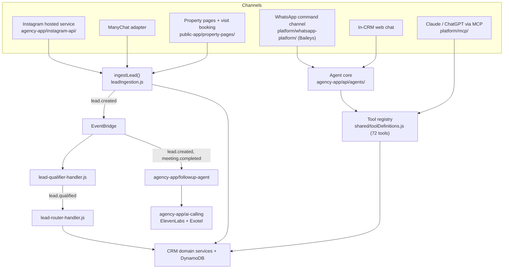

# 18 — Migration Strategy

> **Status (17 Sep 2026):** As built + roadmap. Checked against the code on main. The strangler-fig approach held (no rewrite, DynamoDB kept), but most June tools were replaced by what was built (own MCP server, Baileys, in-house agent runtime on Gemini, DynamoDB vectors); Postgres is parked and customer WhatsApp is moving to the official API.

> **Scope:** how the CRM grows into the agency OS **without a rewrite**. Phases: `21-roadmap.md`. Hardening checklist: `00-phase-0-prerequisites.md`.

---

## 1. Principle: Strangle, Don't Rewrite

The serverless CRM (`agency-app/api/`, `agency-app/web/`) stays the core. New capabilities are wrapped around it and reach the business through the same domain services. DynamoDB stays the only source of truth. No design deletes CRM data; old data is archived.

## 2. Current Shape

## 3. The Steps, With Status

| Step (June plan) | Status | As built / next |
|---|---|---|
| **1. Stabilise and expose the core** | Partly done | See rows below |
| — Fine-grained RBAC | Partly done | Auth service issues `ADMIN`/`MEMBER` only (`platform/auth/src/controllers/phoneAuthCustomController.ts`); CRM backend also accepts `MANAGER`/`FOUNDER`/`OWNER` (`agency-app/api/middleware/requireRole.js`); role-based phone masking (`middleware/phoneMasking.js`). No team/region scoping. Next (D15): ADMIN/MEMBER for M1; MANAGER + "members see only their own leads" before selling Team plans (Phase B). |
| — Rotate hardcoded secrets | Partly done | Leaking deploy scripts deleted, env files untracked, SSM/Secrets Manager hydration in place. Keys remain in git history and **rotation is unconfirmed** (D18). No history rewrite; add gitleaks to CI (Phase A). `docs/security-key-rotation.md` |
| — Tenant-scoped reads (MED-1) | Partly done | `getLeads` queries `search-index` (GSI3); other list functions still scan (`TODO(MED-1)` in `agency-app/api/crmDynamodbService.js`). Phase B. |
| — Conversation tables | Done differently | WhatsApp conversation state and history in `agency-app/api/conversationStateService.js`, `whatsappConversationService.js` |
| — Wrap domain endpoints as MCP tools | Done differently | One MCP server, `platform/mcp/`, 72 tools generated from `agency-app/api/shared/toolDefinitions.js`, own OAuth, Streamable HTTP. Not AgentCore Gateway. |
| — Re-enable disabled routes | Partly done | `aiCallingInternal` is mounted (`agency-app/api/server.js`). `routes/projects.js`, `developers.js`, `buildings.js`, `areas.js` exist but are not mounted. |
| **2. Conversation backbone** | Done differently | EventBridge (`lead.created`, `lead.qualified`, `call.ended`) and SQS (call-recording queue, follow-up DLQ). No Redis: dedup via a DynamoDB idempotency log (`logEventIfNotProcessed` in `agency-app/api/webhookLogService.js`, used by `leadIngestion.js`). No Chatwoot (dropped, D9). Channels are adapters into `leadIngestion.js`. |
| **3. Reasoning over tools** | Done differently | Qualifier and router are EventBridge-triggered Lambdas (`agency-app/api/scripts/lead-qualifier-handler.js`, `lead-router-handler.js`). The WhatsApp/web agent is an in-house classify → plan → execute → compose pipeline with an optional bounded tool loop, on Gemini behind a model gateway (`agency-app/api/agents/`). Off unless `AGENTS_ENABLED=true`. |
| **4. Engines one by one** | Partly done | Qualification (Hot/Warm/Cold rubric, `agency-app/api/utils/leadRubric.js`) and routing are built. The founder is building a next-generation lead engine separately; scoring/assignment docs will be updated when it lands (D11). |
| **5. Voice + follow-up journeys** | Done differently | Voice rebuilt on ElevenLabs' native Exotel integration (`agency-app/ai-calling/`), outbound only (D16). Follow-up calls scheduled, retried and escalated by `agency-app/followup-agent/` on EventBridge + DynamoDB, not Step Functions. |
| **6. Strands + AgentCore** | Not adopted | In-house runtime is the direction (D7). See `20-technology-decisions.md`. |
| **7. Aurora reporting projection** | Parked | Postgres/Aurora parked as a possible future reporting store fed from DynamoDB, no date (D8, `27-phase-2-postgres-analytics-agent-tables.md`). |

## 4. Keep / Wrap / Evolve / Retire / Add

| Disposition | Item | Status |
|---|---|---|
| Keep | CRM SPA and backend domain logic, auth service, DynamoDB model, Razorpay billing, Exotel telephony, idempotency and provisioning patterns, Playwright tests | Kept |
| Keep | Knowledge retrieval | Now DynamoDB vector search + Titan v2 embeddings (`agency-app/api/services/embeddings/`, `services/knowledge/`), not the Bedrock KB pattern |
| Wrap | CRM, lead, property, visit endpoints as tools | Done (one registry → WhatsApp agent, CRM backend, MCP server) |
| Evolve | `ai-calling-service` from regex flows to agents | Done (ElevenLabs agents with mid-call CRM tools) |
| Evolve | Skills → tools | Done via the generated registry |
| Evolve | "AI Employee" from human SLA to agent | Partly: WhatsApp agent + follow-up agent with `draft`/`autosend` modes (`agency-app/api/routes/aiEmployeeConfig.js`), still set up by a concierge (`aiEmployeeProvisioningService.js`) |
| Retire | Hardcoded-secret deploy script | Done (deleted) |
| Retire | In-memory rate limiter | Not done: still used (`agency-app/api/middleware/rateLimiter.js`); add API Gateway throttling (Phase A, D17) |
| Retire | `apps/onboarding` | Done: deleted in the 2026-09-17 regroup; onboarding runs in `agency-app/api` |
| Add | Channel adapters, agent runtime, qualification/routing, follow-up calls, credits and metering, one MCP server | Done |
| Add | Official WhatsApp Business Cloud API for customer messaging | Planned (D9, `39-whatsapp-official-api-plan.md`) |
| Add | MANAGER role + own-lead scoping, CRM mutation audit (archived, not TTL-deleted), GitHub Actions deploy to dev | Phase B (D15, D17, D19) |
| Add | Reporting projection | Parked (D8) |

## 5. Data Migration

- **Additive only.** New tables were added beside the CRM table (credits, credit config, agent audit, knowledge chunks, push tokens and others in `agency-app/api/infra/cfn-backend.yaml`). No bulk migration was needed and none is planned.
- **No DynamoDB → Postgres migration.** If a reporting store is ever added it is fed from DynamoDB events and DynamoDB stays the source of truth (D8).
- **Index work is a backfill.** New GSIs for MED-1 get backfilled; nothing moves.
- **Archive, never delete.** Audit and ledger rows that today expire by TTL (`AgentAuditTable` 90 days, credit ledger 12 months) should be archived instead (D17).

## 6. WhatsApp Migration (D9)

Today WhatsApp runs on self-hosted Baileys (`platform/whatsapp-platform/`, ECS Fargate) and the CRM only acts on the agency's own self-chat or whitelisted admin senders (`agency-app/api/routes/webhooks.js`). Baileys is an unofficial client, so it is not safe for customer messaging (number-ban risk, `19-risk-analysis.md`).

Direction: customer messaging moves to the **WhatsApp Business Cloud API** (possibly with AiSensy as BSP). Plan, sequencing and what happens to the Baileys command channel: `39-whatsapp-official-api-plan.md`. Chatwoot is dropped.

## 7. Risk Control During Migration

- **Flags:** per-category feature toggles (`agency-app/api/featureToggleService.js`) plus env flags (`AGENTS_ENABLED`, `AGENT_TOOL_LOOP_ENABLED`). There is no per-tenant flag service yet.
- **Human approval first:** follow-up agent `draft` mode before `autosend`; Instagram DM assistant drafts first, auto later (D14).
- **No breaking API changes:** MCP tools sit beside REST and call the same services.
- **Deploy discipline:** manual `infra/cicd/<service>/deploy.sh` wrappers with build tracking and rollback (D19). Deploy only from `main` or the integration branch: a CRM frontend deploy from a different checkout overwrote newer work on 2026-09-15 (`docs/pending-items/deploys-and-branches.md`).

## 8. Team and Sequencing

- Team is a **solo founder + AI agents + contractors**; hires come after a revenue trigger (D20).
- One workstream at a time reaches production; others stay behind flags.
- Reuse over greenfield: extend the existing agent core and adapter pipeline before adding services.

## 9. Definition of "Migrated"

| Condition | Status |
|---|---|
| Every channel and agent reaches the business only through the shared tools / ingestion pipeline | Mostly: Instagram, ManyChat, property pages, WhatsApp command channel, web chat and MCP do; portal lead ingestion is Phase C |
| CRM core unchanged in responsibility but fully wrapped | Done (72-tool registry) |
| AI pieces live behind guardrails | Built; agents off by default; not in prod for customers yet |
| "AI Employee" is a real agent, not a human SLA | Partly (concierge setup remains) |
| Usage metered and billed in credits | Done (`17-cost-and-billing-architecture.md`) |

> **Open question:** mount `routes/projects.js`, `developers.js`, `buildings.js` and `areas.js` (with tests and role checks), or leave them unmounted until a feature needs them?
