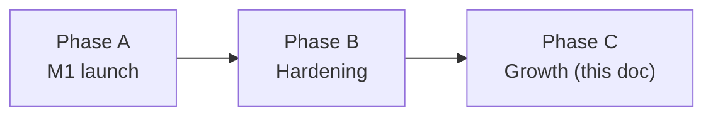

# Phase 3 — Scale: Automation, Marketing, Voice, & Analytics

> **Status (17 Sep 2026):** As built + roadmap. Checked against the code on main. Re-baselined as **Phase C (growth)** with no dates; voice calls and follow-up calls already shipped on EventBridge + DynamoDB, and the June design (Step Functions, Chatwoot, Strands marketing agent, portal posting by browser automation, Postgres dashboards) is replaced or dropped.

---

## 1. Where this sits

The roadmap has three phases and no dates (D13):



Phase C is the growth work that comes after a hardened, paid launch. Several items the June draft put in "Phase 3" were built earlier, on a different design. This doc lists what exists, what Phase C keeps, and what was dropped.

The June prerequisite "Phases 0–2 complete, including Postgres" no longer applies: Postgres is parked (D8, doc 27) and everything below runs on DynamoDB, EventBridge and Lambda.

> **Lead engine:** lead scoring and assignment are already built (qualifier and router, below). The founder is building a next-generation lead engine separately; these docs will be updated when it lands.

---

## 2. Already built (was "Phase 3" in June)

| June Phase 3 item | What shipped instead | Evidence |
|---|---|---|
| Outbound voice ("re-enable the disabled AI Calling service") | AI calling is **live**, not disabled. Outbound calls go through ElevenLabs' native Exotel integration; the agent pulls CRM data mid-call through server tools. CRM routes are mounted at `/api/internal`; the CRM page is `/crm/ai-calling`. | `services/ai-calling-service/README.md`; `apps/crm/server/server.js` (mounts `aiCallingInternalRoutes`); `apps/crm/server/routes/aiCallingInternal.js`; `apps/crm/real-estate-crm-app/src/App.tsx` |
| Call billing | Per started minute, charged once after the call settles, de-duplicated per call session. Pre-call balance check before dialling from the CRM. | `apps/crm/server/aiCallBilling.js`; doc 30 |
| Follow-up automation (Step Functions + Chatwoot) | **`services/followup-agent-service`**: EventBridge schedule tick + event rules, a DynamoDB jobs table and two Lambdas. It schedules AI **calls** for `site_visit_confirmation` (from `lead.created` hints or the CRM button) and `post_visit_feedback` (after `meeting.completed`), with 2 attempts 45 minutes apart inside business hours, then escalation to the assignee and admins. | `services/followup-agent-service/README.md`, `infra/cfn-followup.yaml`, `src/domain/jobEngine.js`; CRM proxy `apps/crm/server/routes/followups.js` |
| Stale-lead follow-up messages | Daily cron (`cron(30 22 * * ? *)` UTC) finds leads with no activity for 1–7 days and asks the agent for a follow-up. Per-tenant mode `draft` (default: saves a note for review) or `autosend` (WhatsApp via Baileys, or email). | `apps/crm/server/scripts/lead-followup-cron.js`; `LeadFollowupRule` in `apps/crm/server/infra/cfn-backend.yaml` |
| Lead qualification, scoring, assignment | `lead.created` → qualifier agent scores Hot/Warm/Cold against a fixed schema → `lead.qualified` → router agent picks a team member by workload. AI calls can also score a lead (`scoreSource: 'ai_call'`). | `apps/crm/server/scripts/lead-qualifier-handler.js`, `scripts/lead-router-handler.js`, `routes/aiCallingInternal.js` |
| Multi-channel lead capture | One ingestion pipeline for every adapter: `POST /api/internal/adapters/leads` → `ingestLead()` (dedupe, create, notify, `lead.created`). Instagram DMs are the first adapter. | `apps/crm/server/routes/adapterIngestionInternal.js`, `apps/crm/server/leadIngestion.js`; `docs/lead-adapter-architecture.md` |
| Call recording analysis | Agency uploads call recordings; they are transcribed, analysed with Gemini, and turned into proposed CRM actions that a person approves before they run. | `apps/crm/server/services/callIntelligence/`; page `apps/crm/real-estate-crm-app/src/pages/crm/CallRecordings.tsx` |
| Agent audit, analytics, credits (June "Phase 2") | All on DynamoDB: agent audit table, credit ledger, team and business analytics. | `apps/crm/server/agents/agentAuditService.js`, `creditService.js`, `teamAnalyticsService.js`; page `src/pages/crm/BusinessAnalytics.tsx` |

---

## 3. Phase C: what we keep (D14)

### 3.1 WhatsApp nurture journeys

**Goal:** multi-touch journeys after a lead qualifies (intro, brochure, floor plan, visit nudge), stopping as soon as the lead replies or books a visit.

**Today:** single-touch follow-ups only (stale-lead cron above; follow-up calls in `followup-agent-service`). No journey definitions, no per-step schedule.

**Direction:**
- Extend the existing `followup-agent-service` job engine (EventBridge + DynamoDB) with message steps next to call steps. Step Functions and Chatwoot were considered in June and are **not adopted**; Chatwoot is dropped (D9).
- Customer messaging moves to the **official WhatsApp Business Cloud API** (possibly through AiSensy as the BSP). Plan: `docs/realestateflow-vision/39-whatsapp-official-api-plan.md` (D9). The self-hosted Baileys link (`services/whatsapp-platform`) stays for the staff command channel.
- Journeys are data (per-tenant JSON), for example:

  ```json
  {
    "id": "journey_2bhk_buyer",
    "trigger": "lead.qualified",
    "filter": { "leadType": "buyer", "score": "HOT" },
    "steps": [
      { "afterHours": 0,   "action": "send_template", "template": "intro_brochure" },
      { "afterHours": 24,  "action": "send_template", "template": "floor_plans" },
      { "afterHours": 168, "action": "ai_call", "purpose": "site_visit_confirmation", "requiresApproval": true }
    ],
    "stopWhen": ["lead.replied", "meeting.created"]
  }
  ```
- Consent is checked before every send; opt-out stops the journey.
- Offer wording (discounts, cashback, prices) always goes through a person first. Nothing in a template may invent an offer.
- Billing today: template/manual sends cost 0 credits; AI-written turns and AI call minutes cost credits (doc 30). Pricing is being re-planned in doc 38.

### 3.2 Inbound AI voice (later)

**Today:** outbound calls only. There is no inbound call handler; the agent prompt lives in `services/ai-calling-service/elevenlabs-agent-prompt.md`.

**Rules for launch (D16):** voice is **outbound only** at launch; consent is captured at lead intake; DLT registration is done before any bulk calling. Inbound (a number prospects can call, answered by the AI agent, which then creates the lead) stays in Phase C, after that.

### 3.3 Instagram DM assistant (draft first, auto later)

**Today:** `apps/instagram/` reads DMs and comments through the Instagram Graph API only (no browser automation of instagram.com). For each thread the lead analyst writes a summary, lead type and score, next action and a **suggested Hinglish reply**; a person sends the reply from the console (`POST /threads/:threadId/reply`). Comment keyword rules exist. Leads flow into the CRM through the adapter pipeline. Deployed to dev; the real-Meta tester test and prod deploy are still pending.

Evidence: `apps/instagram/backend_insta_sol_ms/services/leadAnalyst.js`, `routes/threads.js`, `services/ruleMatcher.js`, `services/crmBridge.js`.

**Phase C:** allow auto-send for low-risk replies per tenant, only after drafts have a track record, and inside Meta's messaging-window policy (`services/windowPolicy.js`).

### 3.4 Brochure and floor-plan tools

**Today:** projects accept a brochure PDF upload (`POST /api/crm/projects/:projectId/brochure`, `apps/crm/server/routes/projects.js`), and properties have documents (`get_property_documents`, `create_property_document` in the tool registry, `apps/crm/server/shared/toolDefinitions.js`).

**Phase C:** let the AI Employee and journeys send the right brochure or floor plan for a matched property or project, as a WhatsApp document through the official API.

### 3.5 Portal lead ingestion

**Today:** the adapter pipeline exists; there is no portal adapter. "99acres" and "MagicBricks" appear only as lead-source strings in tests.

**Phase C:** add adapters that bring leads **in** from portals through channels the portals allow (lead e-mails, official feeds or APIs), each ending in `POST /api/internal/adapters/leads`. No logging in to portals with stored credentials.

### 3.6 Tenant social publishing (after Meta App Review)

**Today:** not built in the product. Higgsfield, Meta Ads and Blotato are used only for RealEstateFlow's **own** marketing (`.mcp.json`, `CLAUDE.md`), not inside `apps/` or `services/`.

**Phase C:** let a tenant publish a property post to their own Instagram/Facebook through the Graph API, after Meta App Review approves the permissions. A person approves every post.

### 3.7 Analytics (measurement layer)

**Today:** team analytics (`/api/admin/team-analytics`, `/agent-activity`), business analytics page, 15 read-only metrics tools also exposed through MCP (`get_pipeline_summary`, `get_business_trends`, `get_followup_summary`, …), PostHog events from billing and paywall.

**Phase C (design only):** funnel by source (Instagram, WhatsApp, portal, web), cost per lead using the credit ledger, and a cohort view. Built on DynamoDB reads first; a Postgres reporting store is parked (doc 27).

---

## 4. Dropped (D14) and not adopted (D7)

| Item | Decision | Why |
|---|---|---|
| Posting listings to 99acres, MagicBricks, Housing.com by browser automation | **Dropped** | Account-block and terms-of-service risk; same risk class as the rule to use only the Graph API for Instagram. |
| Tenant-facing marketing agent (campaign generation, Meta Ads buying, social scheduling for tenants) | **Dropped** | Out of scope for the product. Tenant social publishing (3.6) stays, with human approval. |
| Telegram channel | **Dropped** | No transport code exists. Remove it from customer-facing copy (for example `apps/crm/real-estate-crm-app/src/pages/crm/AIEmployeeStatus.tsx` and the legal pages). |
| Chatwoot | **Dropped** (D9) | Customer messaging goes to the official WhatsApp Cloud API. |
| AWS Step Functions for journeys | Considered, not adopted | The EventBridge + DynamoDB job engine in `followup-agent-service` already does scheduling, retries and escalation. |
| Strands agents, AgentCore (Gateway, Browser Tool), Bedrock agents, Nova Sonic | Considered, not adopted (D7) | The product runs an in-house pipeline (domain router → planner or bounded tool loop → composer) behind a model gateway, Gemini by default (`apps/crm/server/agents/`). Voice is ElevenLabs + Exotel. |
| "Expose Voice Agent via MCP" | Not planned | The MCP server exposes CRM tools only (doc 37). |

---

## 5. Order of work inside Phase C

| Order | Item | Builds on |
|---|---|---|
| 1 | Instagram DM assistant to production (tester test, prod deploy), still draft-only | `apps/instagram/` |
| 2 | Official WhatsApp Cloud API for customer messages | doc 39 |
| 3 | WhatsApp nurture journeys + brochure/floor-plan sending | `followup-agent-service`, doc 39 |
| 4 | Portal lead ingestion adapters | adapter pipeline |
| 5 | Analytics: funnel by source and cost per lead | DynamoDB analytics, credit ledger |
| 6 | Tenant social publishing | Meta App Review |
| 7 | Inbound AI voice; Instagram auto-send | D16 prerequisites; draft track record |

Team model: solo founder plus AI agents and contractors (D20), so items run mostly one at a time.

---

## 6. Phase C success criteria

These are targets to measure against, not results. The product is pre-launch with no customers.

| Milestone | Target |
|---|---|
| Nurture journeys live | Qualified leads get at least two touches unless they reply first; opt-outs honoured every time |
| Instagram assistant | Drafts accepted without edits often enough to justify auto-send for a narrow set of replies |
| Portal ingestion | Portal leads land in the CRM through the adapter pipeline with no duplicates |
| Analytics | A tenant can see leads, qualified leads and visits by source, and credits spent per lead |
| Cost control | A tenant cannot spend AI credits beyond their balance (already enforced); budget caps and low-balance alerts added (doc 30) |

---

## What stays true

- **No CRM migration.** Leads, contacts and properties stay on DynamoDB.
- **Build on what shipped.** Extend `followup-agent-service`, the adapter pipeline and the agent runtime instead of adding new platforms.
- **People approve risky actions.** Offers, public posts and anything that commits the agency go through a person.
