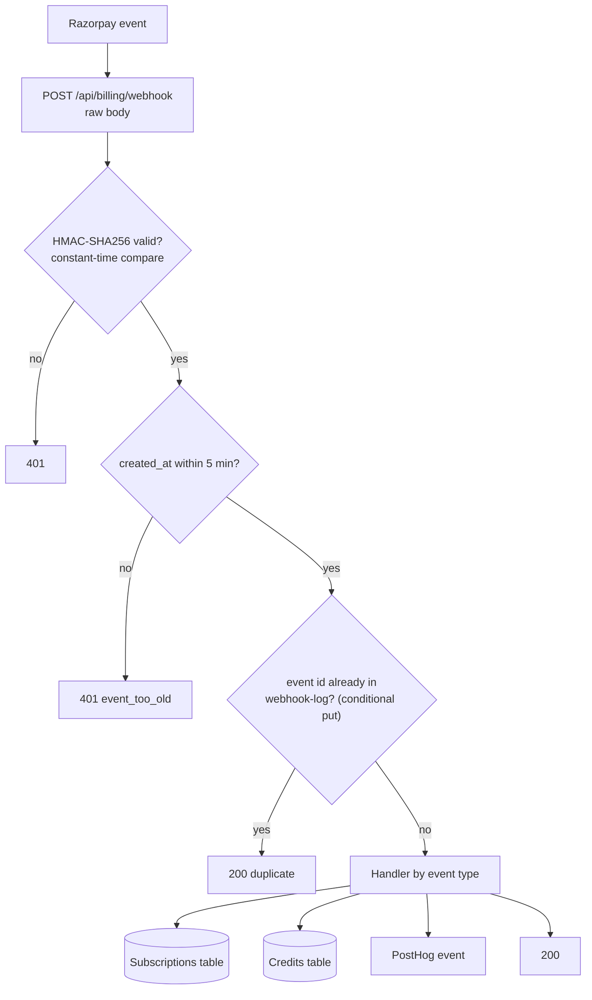
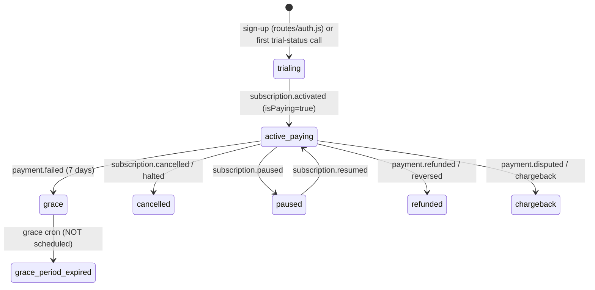

# 29 — Payment System Implementation

> **Status (17 Sep 2026):** As built + roadmap. Checked against the code on main. Rewritten from a June fix spec into a description of the Razorpay system as built, with the gaps that must close before paid launch (D17); two of the June gaps are fixed, the rest are tracked below, and new issues found in the code are added.

---

## 1. Summary

- **Processor:** Razorpay only. No Stripe, Lago, Cashfree, PayU or PhonePe code exists.
- **Two things can be bought:** a **plan subscription** (Razorpay Subscriptions, including a separate AI Employee plan) and a one-time **credit pack** (Razorpay Orders).
- **Source of truth for payment state:** the Subscriptions table on DynamoDB, one row per tenant, updated by the Razorpay webhook.
- **Web only.** The mobile builds show no prices and no checkout (App Store 3.1.1 / Google Play billing rules); `apps/crm/real-estate-crm-app/src/lib/razorpay.ts` refuses to open checkout inside the native app.

**Pricing** is not defined here. Current (pre-launch) pricing is in `marketing-and-sales/launch-plan-v2/pricing.json` and CRM `apps/crm/real-estate-crm-app/src/lib/plans.ts`, which disagree on Team+; it is being replaced by the proposal in `docs/realestateflow-vision/38-pricing-plan-contacts-and-credits.md`.

---

## 2. Components

| Part | File |
|---|---|
| Webhook receiver (all Razorpay events) | `apps/crm/server/routes/billing.js`, mounted at `/api/billing` before `express.json()` with its own rate limit (`apps/crm/server/server.js`) |
| Subscription row helpers | `apps/crm/server/subscriptionService.js` |
| Tenant-facing subscription and credit API | `apps/crm/server/routes/subscriptions.js`, mounted at `/api/subscriptions` |
| Razorpay Orders client (credit packs) | `apps/crm/server/razorpayOrders.js` |
| Webhook idempotency log | `apps/crm/server/webhookLogService.js` (table `${Env}-realestateflow-webhook-log`, 30-day TTL) |
| AI Employee provisioning | `apps/crm/server/aiEmployeeProvisioningService.js` |
| Tables | `SubscriptionsTable`, `WebhookLogTable` in `apps/crm/server/infra/launch-tables-cfn.yaml` (deployed via `infra/cicd/launch-tables`) |
| Scheduled jobs | `apps/crm/server/scripts/trial-reminder-cron.js`, `grace-period-expiry-cron.js`, `credit-reset-cron.js`, `escalation-cron.js` |
| Frontend | `src/lib/razorpay.ts`, `src/components/PaywallModal.tsx`, `src/components/TrialCountdownBanner.tsx`, `src/components/BuyCreditsModal.tsx`, `src/pages/crm/BillingSettings.tsx`, `src/lib/plans.ts` (all under `apps/crm/real-estate-crm-app/`) |

Secrets (`RazorpayKeySecret`, `RazorpayWebhookSecret`, `BrevoApiKey`, …) reach the CRM Lambda as `NoEcho` CloudFormation parameters synced from SSM (`apps/crm/server/infra/sync-ssm-params.sh`, `ssm-param-map.txt`). Moving them to Secrets Manager is a goal, not the current state.

---

## 3. How a webhook is processed

The tenant is read from `notes.tenantId` (or `notes.tenant_id`) on the subscription or payment and must match `^[a-zA-Z0-9_-]{1,100}$`. No GSI lookup by Razorpay subscription id is needed, so the June "`razorpay-subscription-index` GSI" task is dropped.

### Events handled

| Event | What the code does |
|---|---|
| `subscription.activated` | If the plan is `RAZORPAY_PLAN_AI_EMPLOYEE`: create a provisioning row, email the founder, send an AiSensy WhatsApp broadcast, then auto-activate the AI Employee (`status=live`, `aiEmployeeEnabled=true`). For every plan: store `billingAnniversaryDay` from `start_at` and set `isPaying=true`. PostHog `subscription_started`. |
| `subscription.charged` | PostHog `subscription_invoiced` and `subscription_paid` only. |
| `payment.captured` | PostHog. If `notes.credits` is set (credit pack order): grant that many credits once per payment id (capped by `MAX_WEBHOOK_CREDIT_GRANT`, default 100,000). If the plan id or name looks like an AI Employee plan: activate the AI Employee. |
| `payment.failed` | PostHog. If the tenant is paying and not already in grace: set `gracePeriodActive=true` and `gracePeriodEndsAt` = now + `GRACE_PERIOD_DAYS` (default **7**); email the founder. |
| `payment.refunded`, `payment.reversed` | Deduct the credits granted for that payment (if any), set `paymentStatus` to `refunded`/`reversed` and `isPaying=false`. |
| `payment.disputed`, `payment.chargeback` | Set `paymentStatus=chargeback`, `isPaying=false`, claw back granted credits, email the founder. |
| `subscription.cancelled`, `subscription.halted` | Suspend the AI Employee if it was that plan; set `isPaying=false`, `paymentStatus` `cancelled`/`halted`, `cancelledAt`. |
| `subscription.updated` | Seat change: add seats, or remove seats unless more users exist than the new seat count (then logged and skipped). |
| `subscription.paused` / `subscription.resumed` | `paymentStatus=paused`; or `paymentStatus=active`, `isPaying=true`. |

---

## 4. Subscription row (as written by the code)

Table `${Env}-realestateflow-subscriptions`, partition key `tenantId`, GSIs `paymentStatus-createdAt-index` and `updatedAt-index`. All timestamps are ISO strings.

| Field | Set by | Values / notes |
|---|---|---|
| `tenantId` | trial creation | string |
| `plan` | trial creation | `solo` \| `team` \| `teamplus` \| `free`. Every current code path writes `solo` (see issue P2). |
| `seatsPaid`, `seatsUsed` | trial creation, `subscription.updated`, member changes | seat defaults: solo 1, team 3, teamplus 5, free 1 |
| `trialEndsAt` | trial creation | now + `TRIAL_DAYS` (default **14**) |
| `isPaying` | trial (`false`), activation, refund, chargeback, cancel, pause/resume, grace expiry | boolean |
| `paymentStatus` | webhook and crons | `trialing`, `active`, `cancelled`, `halted`, `refunded`, `reversed`, `chargeback`, `paused`, `grace_period_expired` |
| `gracePeriodActive`, `gracePeriodEndsAt`, `gracePeriodExpiredAt` | `payment.failed`, grace cron | |
| `razorpaySubscriptionId`, `nextBillingDate` | trial creation (`null`), cancel | `nextBillingDate` is never set by current code |
| `billingAnniversaryDay` | `subscription.activated` | 1–31, used by the monthly credit reset |
| `lastCreditResetAt` | credit reset cron | `YYYY-MM-DD` |
| `consentSignedAt` | post-registration | DPDP consent time |
| `lastTrialEmail`, `lastTrialEmailAt` | trial reminder cron | idempotency for reminder emails |
| `cancelledAt`, `refundedAt`, `chargebackAt`, `pausedAt`, `resumedAt`, `createdAt`, `updatedAt` | various | |

---

## 5. Lifecycle

- **Trial:** created on post-registration (`apps/crm/server/routes/auth.js`) or auto-created by `GET /api/subscriptions/trial-status`. Reminder emails at day 10, 12 and 14 and 3 days after expiry, from `TrialReminderFunction` on `cron(30 3 * * ? *)` UTC (`apps/crm/server/infra/cfn-backend.yaml`).
- **Paywall (web):** `PaywallModal` opens when the trial has expired, the tenant is not paying and no grace period is active, except on `/profile`, `/crm/settings/billing`, `/legal`, `/grievance`, `/integrations/ai-employee`. `TrialCountdownBanner` shows in the last 7 days of trial. Both are **frontend only**.
- **Grace:** starts only on `payment.failed` for a paying tenant. The expiry script sets `isPaying=false`, `paymentStatus=grace_period_expired` and suspends the AI Employee, but there is no Lambda or EventBridge rule for it in any template.
- **Credit packs:** `POST /api/subscriptions/credits/purchase` (roles `ADMIN`, `FOUNDER`, `OWNER`) creates a Razorpay Order at the **server-side** pack price; `payment.captured` grants the credits. Details in doc 30.

---

## 6. Gap tracker

### June gaps

| # | June gap | Status (Sep 2026) | Evidence / remaining work |
|---|---|---|---|
| 1 | `subscription.cancelled` never updates the DB | **Fixed**, differently: tenant from `notes`, no GSI. `subscription.halted` handled too. | `routes/billing.js` cancelled/halted case |
| 2a | `payment.failed` → grace | **Partly fixed.** Grace fields set, founder emailed. The tenant is not told. | `routes/billing.js` payment.failed case |
| 2b | `subscription.charged` clears grace | **Open.** Only PostHog events. A recovered payment leaves `gracePeriodActive=true`. | Clear grace fields and set `paymentStatus=active` |
| 3 | Grace expiry cron | **Half done.** Script exists; not scheduled. | Add `GracePeriodExpiryFunction` + rule to `apps/crm/server/infra/cfn-backend.yaml` (handler `scripts/grace-period-expiry-cron.handler`) |
| 4 | Server-enforced read-only | **Open.** No middleware. The paywall copy promises "7-day grace … read-only for 30 days". | Middleware returning 402 on writes when not paying, not trialing and not in grace; before paid launch (D17) |
| 5 | In-app cancellation | **Open.** No cancel route, no UI. | Cancel route that calls Razorpay cancel at cycle end, plus a confirm dialog |
| 6 | AI Employee approval UI | **Mostly moot.** Activation is now automatic on `subscription.activated`. The ₹500 SLA credit note is still a manual step logged by `scripts/escalation-cron.js`. | Decide whether the SLA credit stays |
| 7 | Payment-failed banner | **Open.** `trial-status` returns `paymentStatus` and `gracePeriodActive` but not `gracePeriodEndsAt`; no banner. | Add fields and a banner |

### Issues found in the code (not in the June doc)

| # | Issue | Evidence | Fix |
|---|---|---|---|
| P1 | **Plan checkout is not wired end to end.** No server code creates a Razorpay subscription. The paywall passes `plan_<tier>_<cycle>` as `subscription_id` to Razorpay Checkout, which expects a subscription id created through the API. Credit-pack checkout (Orders) is wired. | `PaywallModal.tsx` `handleCheckout`; `lib/razorpay.ts` sets `subscription_id: opts.planId`; no `v1/subscriptions` call in `apps/` or `services/` | Server route that creates the subscription with `notes.tenantId`, returns its id to checkout |
| P2 | **Activation does not record the plan or status.** `subscription.activated` sets `isPaying=true` (via `setBillingAnniversaryDay`) but leaves `plan=solo` and `paymentStatus=trialing`. The monthly credit reset picks the allotment from `plan`, so a paying Team tenant would get the free allotment. | `routes/billing.js` activated case; `subscriptionService.js` `setBillingAnniversaryDay`; `scripts/credit-reset-cron.js` `getMonthlyAllotment` | Map Razorpay `plan_id` to `plan`, set `paymentStatus=active` |
| P3 | **Failed webhook handling is lost.** The event id is logged before the handler runs; if the handler throws, the 500 makes Razorpay retry, but the retry is treated as a duplicate. Retries older than 5 minutes are also rejected by the age check. | `routes/billing.js` steps 3 and 5, and the catch block comment | Mark the log row "processing" and complete it after success; accept retries by event id instead of rejecting on age |
| P4 | Grace is only for failed renewals. The paywall copy says trial expiry also gets 7 days of grace. | `PaywallModal.tsx` `DATA_SAFETY_COPY` | Align copy with behaviour, or add trial grace |

---

## 7. Before paid launch (D17)

Must be done before the first paid customer:

1. **Plan checkout (P1) and activation state (P2).** Without these, no plan can be bought correctly.
2. **Webhook retry safety (P3).**
3. **Grace:** schedule the expiry cron; clear grace on `subscription.charged` (2b).
4. **Server-enforced read-only after grace** (gap 4), and make the paywall copy match.
5. **API throttling and access logs** on the CRM API.
6. **CORS fix** (allowlist is in `apps/crm/server/utils/corsOrigins.js`).
7. **Archive audit-log rows instead of TTL delete** (agent audit rows currently expire after 90 days, `apps/crm/server/agents/agentAuditService.js`).

After the first customers: WAF on the API (D17), in-app cancellation (gap 5), payment-failed banner and tenant email (gaps 2a, 7), Secrets Manager for payment secrets.

Never delete tenant data in any of these flows: cancellation, refund, chargeback and grace expiry change status and access only.
