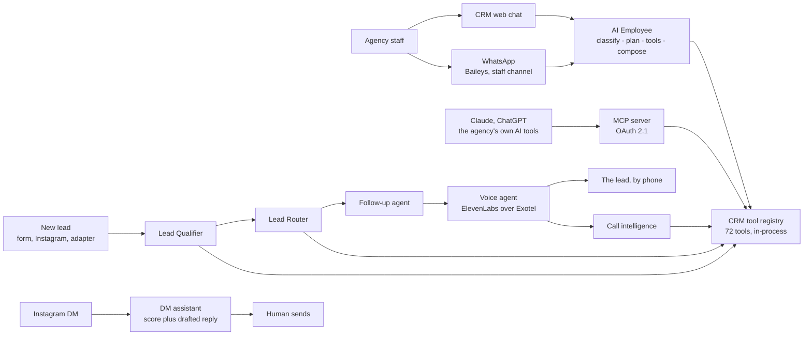

# 37 — Product Agents and MCP — Tenant Guide

> **Status (17 Sep 2026):** As built + roadmap. Checked against the code on main. Rewritten around what an agency actually gets: one AI Employee plus four background agents, one voice agent, and **one** MCP server with 72 tools. The June guide promised 10 agent personas and 11 domain MCP servers, most of which were never built; that design is kept at the end as "considered, not adopted".

> **Scope:** the tenant-facing view — which agents exist, what they can touch, which channels they reach, what they cost, and where a human stays in the loop. Runtime internals: `04`. MCP internals: `05`. Retrieval: `14`. Credit mechanics: `30`. Prices: `docs/realestateflow-vision/38-pricing-plan-contacts-and-credits.md` (proposed, awaiting approval).

---

## 1. What an agency gets today

| Agent | What it does | Where it runs | Who it talks to |
|---|---|---|---|
| **AI Employee** | Conversational CRM assistant: find leads, open a record, add a note, match properties, book a meeting, give a daily brief | `agency-app/api/agents/` inside the CRM API Lambda | Agency staff, in the CRM web chat and on WhatsApp |
| **Lead Qualifier** | On every new lead, extracts requirement details and sets a Hot / Warm / Cold temperature | `agency-app/api/scripts/lead-qualifier-handler.js`, on `lead.created` | Nobody — it writes to the lead |
| **Lead Router** | Picks an assignee for a qualified lead, falling back to least-loaded | `agency-app/api/scripts/lead-router-handler.js`, on `lead.qualified` | Nobody — it assigns and notifies |
| **Follow-up agent** | Decides when to call a lead back, retries, escalates to a human | `agency-app/followup-agent` | Schedules the voice agent |
| **Voice agent** | Places the outbound call, answers from live CRM data, books or confirms a site visit | `agency-app/ai-calling` + ElevenLabs over Exotel | The lead, on the phone |
| **Call intelligence** | Transcribes a finished call, extracts entities, proposes CRM actions | `agency-app/api/services/callIntelligence/` | Nobody — it writes back to the CRM |
| **Instagram DM assistant** | Turns a DM thread into a scored lead and **drafts** a Hinglish reply for a human to send | `agency-app/instagram-api/services/leadAnalyst.js` | Drafts only; a human sends |

There is no separate "Sales Assistant", "Scorer", "Marketing Agent", "Automation Agent" or "Agency-Command" agent. Qualification and scoring are one step inside the qualifier. The owner-copilot job is just the AI Employee asked an owner question — `get_daily_brief`, `suggest_next_actions`, `get_business_health` and `get_work_queue` are ordinary tools in the same registry.

> **D11 — lead engine.** Lead scoring and assignment are built and documented as built (`10`, `11`). The founder is building a next-generation lead engine separately; these docs will be updated when it lands. No target redesign is written here in the meantime.

## 2. The AI Employee

One agent, two transports:

- **CRM web chat** — `POST /api/crm/agent-chat`, Server-Sent Events so the UI can show tool activity. In the Lambda deployment the events currently arrive in one batch at the end; locally they stream (`agency-app/api/routes/agentChat.js`).
- **WhatsApp** — inbound messages from the self-hosted Baileys workers land on EventBridge (`whatsapp.incoming` / `message.received`) and are handled by the `whatsapp-processor` Lambda. This is a **staff** channel today: only numbers on the `AI_ADMIN_WHATSAPP_NUMBERS` allowlist reach the agent (`agency-app/api/whatsappConversationService.js`), and that list is a deploy-time parameter, not yet a per-tenant setting. Customer-facing WhatsApp moves to the official Business Cloud API (D9, `39`).

A turn runs **classify → plan → run tools → compose**, through `agency-app/api/agents/modelGateway/index.js`. The gateway is the seam where the model lives: today both tiers are Gemini — `gemini-3.1-flash-lite` for the classifier and `gemini-3.8-flash` for the planner and composer (defaults in `agency-app/api/infra/cfn-backend.yaml`). The runtime is in-house, not a framework (D7, `04`). The `LlmProvider` / `BedrockModelId` CloudFormation parameters still default to `bedrock` and Claude 3 Haiku, but nothing in the runtime reads them — that is stale config, and it is on the clean-up list.

The agent calls CRM tools **in-process** through `agency-app/api/skillInvoker.js`, against the same registry the MCP server publishes (`agency-app/api/shared/toolDefinitions.js`). So an agency gets the same capabilities whether it asks the AI Employee or its own Claude.

Presentation is deliberately split from reasoning: `agents/interaction/decideInteraction.js` decides who owns the reply — a deterministic formatter for lists, details and confirmations; the model only for genuinely open-ended text. That is why a list of leads always looks the same.

## 3. Background agents

**Qualifier.** Fires on `lead.created`. It reads what came in and writes back requirement details and a temperature: HOT means ready to buy with a named area or building, WARM means wants to visit, COLD means months out. It runs **once**, at creation — there is no re-scoring or decay yet (`10`).

**Router.** Fires on `lead.qualified`. A model call picks the assignee from the tenant's members, with a least-loaded fallback if it cannot. There are no territories, capacity limits or SLA timers (`11`).

**Follow-up agent.** Two job types today (`agency-app/followup-agent`):

| Trigger | Job | Goal |
|---|---|---|
| `lead.created` with a follow-up hint, the CRM "Schedule AI follow-up" button, or — if the tenant opts in — any new Instagram lead with a phone | `site_visit_confirmation` | Confirm the slot, answer questions from live inventory |
| `meeting.completed` for a site visit | `post_visit_feedback`, 2 h later by default | Ask how the visit went, catch open issues |

Each job moves `scheduled → calling → done | needs_human`, with up to 2 attempts 45 minutes apart, inside the tenant's business hours. Escalations reach the lead's assignee and the agency admins in-app, by email and by WhatsApp, with a note on the lead. The engine is a DynamoDB job table on a 5-minute EventBridge tick — not Step Functions.

**Call intelligence.** After a call, the recording goes through an SQS queue to a worker that transcribes it, resolves entities and plans CRM actions (`agency-app/api/services/callIntelligence/`).

## 4. The voice agent

Outbound only at launch (D16). One request to ElevenLabs both dials through Exotel and bridges the audio; there is no audio bridge for us to run. Mid-call the agent calls back into the service for live data, using nine server tools:

`search_properties`, `get_property_details`, `schedule_site_visit`, `answer_policy_question`, `submit_qualification`, `request_human_handoff`, `confirm_site_visit`, `record_visit_feedback`, `request_callback` (`agency-app/ai-calling/src/routes/tools.js`).

The tenant is bound from a signed dynamic variable on the call, never from something the model says. `answer_policy_question` is grounded in the tenant's own knowledge chunks (`14`) — the agent does not invent policy.

Not built: an inbound number, batch outbound calling, and DND / DLT handling beyond a business-hours window. Consent is captured at intake and DLT registration comes before any bulk calling (D16, `12`).

## 5. Instagram

The hosted Instagram service reads DMs through the **Graph API only** — never by driving instagram.com — and turns a thread into a lead: who this is, what they want, a Hot / Warm / Cold score and a drafted Hinglish reply. A human sends the reply. The analyst has two interchangeable providers, deterministic rules and Gemini, and whatever the model returns is checked back against the conversation before it is kept — a phone number is only accepted if it appears in the lead's own messages, and any model failure falls back to the rules result rather than dropping the lead (`agency-app/instagram-api/services/leadAnalyst.js`). Auto-send comes later, and tenant social publishing waits on Meta App Review (D14, `13`). There is no `content_publish` permission in the current review scope.

## 6. The MCP server

**One server**, `platform/mcp`, not eleven (D10). It runs on Lambda behind API Gateway with its own OAuth 2.1 flow, validating Cognito tokens. An agency connects it from **CRM Dashboard → AI Integrations → Connect to Claude / Connect to ChatGPT**, approves the scopes, and its own AI tool can then work with its CRM (`docs/MCP_AGENCY_GUIDE.md`).

The tool list is **generated** from the CRM registry (`agency-app/api/scripts/generate-mcp-tools.mjs` → `src/services/generatedToolDefinitions.ts`), so the MCP surface and the AI Employee's surface cannot drift apart.

**72 tools**, 42 of them read-only:

| Group | Tools | Examples |
|---|---|---|
| Metrics and analytics | 15 | `get_crm_metrics`, `get_pipeline_summary`, `get_daily_brief`, `suggest_next_actions`, `get_business_health`, `get_work_queue`, `get_business_trends` |
| Contact | 10 | create / get / search / update / archive, notes, `find_person`, `find_contact_by_phone`, role update |
| Property | 9 | create / get / search / update / archive, `match_properties`, documents |
| Tenant | 8 | create / get / search / update / archive, notes, `get_tenant_by_phone` |
| Owner | 8 | create / get / list / update / archive, notes, `get_owner_by_phone` |
| Lead | 8 | create / get / search / update / archive / convert, notes |
| Buyer | 7 | create / get / search / update / archive, notes |
| Meeting | 5 | create, get, get upcoming, update, archive |
| Khata | 2 | `search_khata_entries`, `get_khata_summary` |

**5 resources:** `crm://recent-leads`, `crm://upcoming-meetings`, `crm://agency-profile`, `crm://hot-leads`, `crm://active-properties`.

**5 prompts:** `qualify-lead`, `draft-followup`, `daily-summary`, `property-match`, `meeting-prep`.

**Scopes.** Every tool maps to exactly one OAuth scope, `read_<noun>` or `write_<noun>` over nine nouns (leads, contacts, properties, tenants, owners, buyers, meetings, khata, metrics). A tool in an unrecognised category falls back to the wildcard `crm` scope rather than to "unrestricted", so a newly added tool can never be silently callable by every client. Archiving counts as a **write** — it is reversible, not free (`platform/mcp/src/services/toolDefinitions.ts`).

**Tenant isolation.** Tenant comes from the authenticated token, never from a model argument, and no tool can reach another agency's data (`15 §5`).

> `docs/MCP_AGENCY_GUIDE.md` still says "54 Total" in its tool heading. That number is stale; the generated count is 72.

## 7. What it costs

Credits, not tokens, and not per tool call:

- **Manual CRM work is free.** Typing a lead, contact, property or khata entry costs 0. So does CRUD through MCP.
- **AI work costs credits.** One AI agent turn costs **15**; one started minute of an AI phone call costs **15**. 1 credit = ₹1.
- Every tenant gets a monthly free allotment (1,000 credits by default), which **replaces** the balance rather than carrying over. Top-ups are bought through Razorpay.

Mechanics and the ledger: `30`. Costs and packs are runtime-editable by a platform operator without a deploy (`agency-app/api/creditConfig.js`).

**Prices are being re-planned.** Today's live numbers sit in `marketing-and-sales/launch-plan-v2/pricing.json` and CRM `agency-app/web/src/lib/plans.ts`, which disagree on Team+. The replacement proposal — plans limited by number of properties plus AI credits, property search not consuming AI credits, and a new billable unit "Contacts" for leads contacted — is in `docs/realestateflow-vision/38-pricing-plan-contacts-and-credits.md` (proposed, awaiting founder approval). Do not quote a final price from this doc.

## 8. Where the human stays in the loop

There is no configurable autonomy dial and no approval-queue screen; neither was built. What exists is simpler and more honest:

- **Unattended, but low-stakes:** qualification, routing, follow-up scheduling, call analysis. These write to CRM records and notify people; they do not message a customer on their own.
- **Draft first:** Instagram replies are drafted for a human to send.
- **Explicit consent per call:** the follow-up agent only calls on a follow-up hint, the CRM button, or a tenant opt-in for Instagram leads with a phone.
- **Feature toggles:** a tenant's AI Employee can be off entirely, and `ai_qualification`, `ai_routing` and `ai_followup` are separate runtime toggles (`agency-app/api/featureToggleService.js`).
- **Never delete:** archive is the strongest destructive action any agent has. CRM data is not deleted.
- **Audited:** agent actions land in the `AgentAudit` table. Rows currently carry a 90-day TTL; D17 replaces that with archiving (`15 §7`).

## 9. Roadmap

Kept (D14, ordered by `21`):

- WhatsApp nurture journeys, on the official Cloud API (`39`).
- Instagram DM assistant moving from draft-first to auto-send.
- Inbound AI voice.
- Brochure and floor-plan tools, served through property-pages links.
- Portal **lead ingestion** (reading leads in), through adapters.
- Tenant social publishing, after Meta App Review.

Dropped (D14):

- **Posting to portals by browser automation** — the same account-block risk class as scraping Instagram, and not worth it.
- **A tenant-facing marketing agent** — campaign generation, ad buying and social publishing stay founder-side tooling, not a product feature.
- **Telegram** — advertised in some older copy with no transport code behind it. Remove it from customer-facing copy rather than build it.

## 10. Considered in June, not adopted

The June version of this guide promised:

- **10 agent personas** — Router, Sales Assistant, Qualifier, Scorer, Assignment, Follow-Up, Voice, Marketing, Automation, Agency-Command. Built: one conversational agent plus four background agents and a voice agent (§1). Router, Qualifier and Scorer collapsed into the qualifier and the AI Employee's own classifier; Agency-Command is the AI Employee answering owner questions; Marketing and Automation are dropped.
- **11 MCP domain servers** — Lead, Property, CRM, Visit, Task, Knowledge, Voice, Marketing, Automation, Document, Analytics, each with its own tool catalogue. Built: one server over a generated registry (D10, `05`). Those names survive only as tool categories. Tools such as `get_payment_plan`, `check_availability`, `create_task`, `create_campaign`, `post_to_portal`, `upload_document` and `get_roi_by_channel` do not exist.
- **Claude Haiku / Sonnet tiers and Amazon Nova Sonic for voice** — the product runs Gemini behind the model gateway, and voice is ElevenLabs over Exotel.
- **Slack as an owner channel, an inbound 1800 number, portal auto-posting and a dashboard approval queue** — none exist. Shipped channels are the CRM web app, WhatsApp for staff, Instagram DMs, outbound AI calls, public property pages, and the agency's own Claude or ChatGPT through MCP.
- **A "typical improvement" metrics table** — response time, qualification rate, conversion, cost per lead. RealEstateFlow is pre-launch with no customers, so there is no evidence for any of those figures. They were target hypotheses, and they are removed rather than restated.
